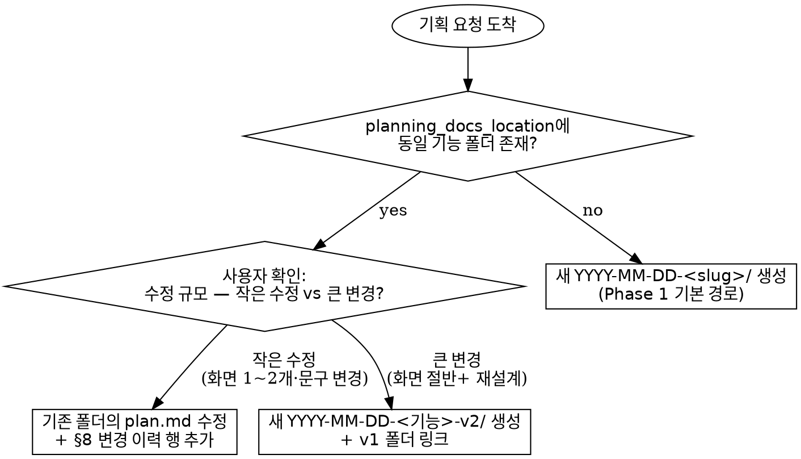
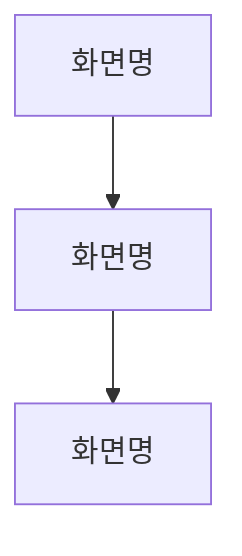
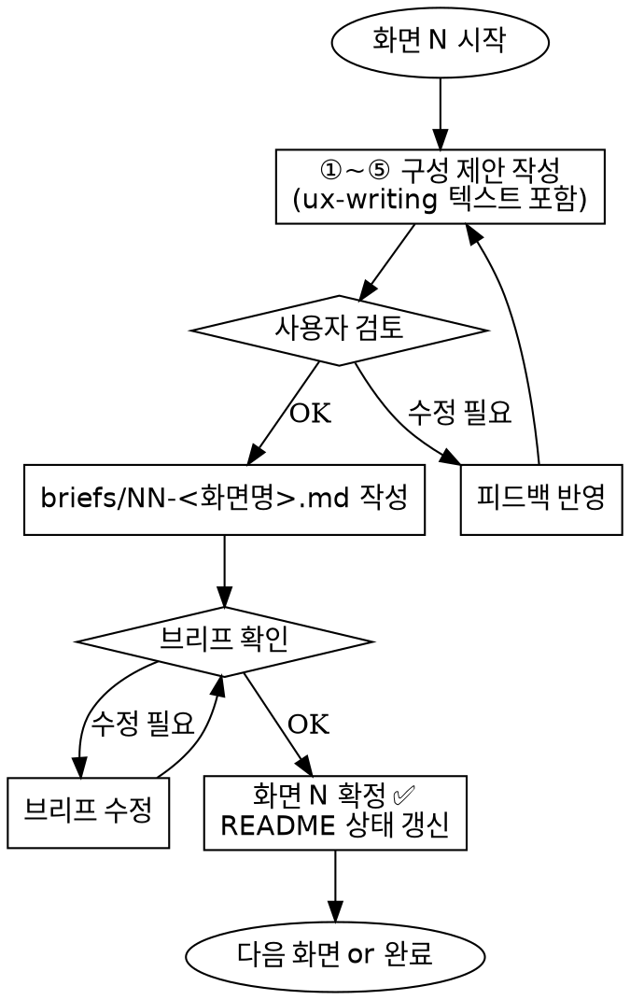
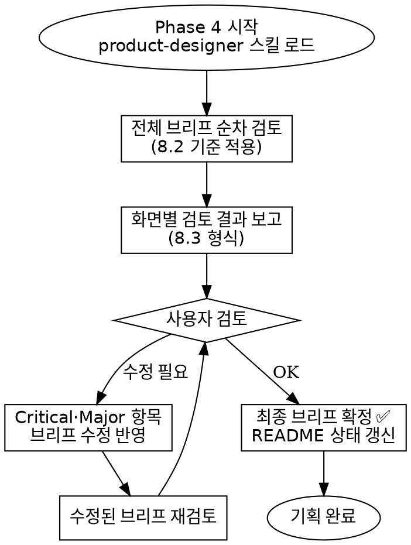

# Product Design Workflow

기획자·UX 디자이너의 **기획 구체화 → 기획서 작성 → 화면 목록·IA 확정 → 화면별 상세 기획 → 검토 및 최종 확정**까지를 오케스트레이션. 범용(personal) 스킬. 프로덕트별 설정은 `design_config` 블록에서 주입받는다.

**이 스킬을 쓰지 않는 경우:**
- 화면 구성이 이미 확정되어 있고 브리프 파일만 정리하면 되는 경우 → 직접 `templates/brief.md` 기반으로 작성
- 단순 문구·레이블 수정만 필요한 경우 → 기존 브리프 직접 편집
- 개발 스펙 문서(API 설계, DB 스키마 등) 작성 → 이 스킬의 범위 밖
- 와이어프레임·목업 작성 → `dou-product-design`
- 브리프가 이미 확정됐고 Next.js 프로토타입에 **코드로 구현**하는 단계 → `dou-product-design`

**경계**: 이 스킬은 *무엇을 만들지 글로 확정하는 단계*(기획~브리프~검토). **시각화는 하지 않는다.** 와이어프레임부터는 `dou-product-design`이 이어받는다. 이 스킬의 최종 산출물인 확정 브리프가 그 스킬의 입력이 된다.

---

## 0. design_config (필수 선행)

cwd 상위의 `CLAUDE.md`에서 아래 블록을 찾는다. 미발견 시 대화로 수집 후 `<project-root>/CLAUDE.md`에 append.

```yaml
design_config:
  product_name: <제품명>
  domain_guide: <DCX GitHub URL 또는 로컬 파일 경로>  # 로컬 파일보다 DCX URL 우선 사용
  planning_docs_location: <기획문서 루트>
  ux_writing_skill: <UX 라이팅 스킬명>  # 필수 — 프로젝트별 UX 라이팅 가이드
```

**domain_guide 값 형식:**
- DCX GitHub URL (권장): `https://github.com/douinc/dcx/tree/main/01-products/<제품명>` — WebFetch로 읽는다. 팀 전체가 공유하는 공식 기준.
- 로컬 파일 경로: `domain/<파일명>.md` — DCX가 없는 경우에만 사용.

상세 예시: `product-config.example.md`.

---

## 1. Phase 개요 (각 Phase 끝에 사용자 승인 필수 — 자동 전진 금지)

| Phase | 산출물 | 승인 체크 |
|-------|--------|-----------|
| **0** | config 로드 요약 | 진행 여부 |
| **1** | 기획 폴더 · `plan.md` · feature README · 최상위 README 갱신 · 도메인 가이드 정합성 검토표 | 기획 내용 + 정합성 검토 확인 |
| **2** | 화면 목록 + 가능성 검토 결과 + `ia.md` 화면 흐름 지도 | 화면 목록 + IA 확인 |
| **3** | 화면별 상세 기획 `briefs/NN-<화면명>.md` (화면당 1개) | 각 화면 확정 |
| **4** | 화면 기획 검토 보고서 + 최종 확정 브리프 | 검토 결과 + 최종 기획 확정 |

---

## 2. 🗂 폴더 구조 (필수)

```
{planning_docs_location}/
├── README.md                      # 전체 기획 인덱스 — 기획 추가·상태 변경 시 갱신
├── YYYY-MM-DD-<기능명>/           # 기획 단위 (Phase 1에서 생성)
│   ├── README.md                  # 이 기획 상태·산출물 인덱스
│   ├── plan.md
│   ├── ia.md                      # 화면 흐름 지도 (Phase 2)
│   ├── briefs/NN-<화면명>.md
│   └── assets/                    # 이 기획 전용 스크린샷
└── ...
```

**금지**: 공용 `briefs/` · 공용 `assets/` · 단일 `YYYY-MM-DD-*.md` 플랫 저장. (Section 11 참조)

**슬러그 규칙**:
- 한국어·숫자·하이픈만. 공백·특수문자 금지.
- 다단어 구분은 **하이픈 선택**. 한 단어처럼 이어도 OK.
- 예: ✅ `다크모드` · ✅ `장바구니-공유` · ✅ `체크아웃-개선` · ❌ `다크 모드` · ❌ `cart_share`

**Multi-platform 기능** (모바일 + 워치 / 모바일 + 웹 등 복수 플랫폼 동시 기획):
- **폴더 1개** 공유. 플랫폼별 폴더 분리 금지.
- `plan.md §5 필요 화면 목록` 표의 **플랫폼 컬럼**으로 구분.
- 브리프 파일명에 플랫폼 suffix: `02-<화면슬러그>-mobile.md`, `02-<화면슬러그>-web.md` (같은 기능·다른 플랫폼).

**기존 기능 업데이트** (이미 기획된 기능에 새 요구사항 추가):
- **작은 수정** (화면 1~2개 추가·문구 변경): 같은 폴더의 `plan.md`를 직접 수정, §8 변경 이력에 행 추가 (`| v1.1 | YYYY-MM-DD | 변경 내용 |`).
- **큰 변경** (화면 절반 이상 재설계, 도메인 규칙 변경 등): `YYYY-MM-DD-<기능>-v2/` 새 폴더 생성 + v1 폴더 링크.
- 판단 기준은 사용자가 선택. agent 단독 결정 금지.

### 결정 흐름 — 신규 vs 업데이트



---

## 3. Phase 0 — 컨텍스트 감지

1. cwd부터 위로 `CLAUDE.md` 탐색 → `design_config` 블록 파싱.
2. `domain_guide` 값 확인:
   - GitHub URL이면 → WebFetch로 해당 디렉터리의 파일 목록과 주요 파일을 읽는다.
   - 로컬 경로면 → Read로 파일을 읽는다.
3. 1줄 요약 보고 후 Phase 1 진행 여부 확인.

미발견 시 대화로 수집해서 `CLAUDE.md`에 append 후 재로드.

### 3.1 신규 제품 — 도메인 가이드가 아직 없는 경우

**0부터 시작하는 신규 서비스·제품은 DCX에 문서가 없는 게 정상이다.** 여기서 막지 않는다.

| 상황 | 처리 |
|------|------|
| DCX에 해당 제품 폴더 있음 | 기존 규칙대로 WebFetch로 읽는다 |
| DCX에 없음 (신규 제품) | `domain_guide: (신규 — Phase 1에서 생성)`으로 두고 진행 |

신규 제품일 때 `domain_guide` 자리를 채우는 방법:

1. Phase 1 브레인스토밍에서 합의된 **도메인 규칙·정책·제약**을
   `{planning_docs_location}/domain/<제품슬러그>.md`로 **먼저 만든다**.
   이 파일이 이번 기획의 판단 기준이 된다.
2. `design_config.domain_guide`에 그 로컬 경로를 적는다.
3. 제품이 확정되면 나중에 DCX로 옮기고 URL로 교체한다 (사용자 판단, agent 단독 금지).

**신규 제품 예외 규칙**:
- Phase 1 §4.4 정합성 검토는 **1번에서 만든 로컬 도메인 파일** 기준으로 수행한다.
- Phase 2 화면 판정에서, 도메인 파일에 근거가 없는 화면은 ❌가 아니라
  **"도메인 파일에 규칙 추가 필요"**로 분류하고 사용자에게 추가 여부를 묻는다.
  (기존 제품의 ❌ = "근거 없음, 제외"와 다르다. 신규는 규칙 자체를 지금 만드는 중이므로.)
- 이 예외는 **신규 제품 최초 기획 1회에만** 적용된다. 도메인 파일이 생긴 뒤의
  후속 기획은 기존 ❌ 규칙을 그대로 따른다.

---

## 4. Phase 1 — 기획 구체화 + plan.md

### 4.1 DCX 확인

`domain_guide`(DCX)를 읽어 기획 요청과 관련된 도메인 규칙·정책·제약·가능 범위를 파악한다. 이것이 기획 전반의 판단 기준이 된다.

- GitHub URL이면 WebFetch로 해당 폴더의 파일 목록을 먼저 읽은 뒤, 기획과 관련된 파일을 선택해 읽는다.
- 로컬 파일이면 Read로 읽는다.

### 4.2 superpowers:brainstorming 스킬 호출

**plan.md 작성 전, 브레인스토밍을 먼저 한다.** `superpowers:brainstorming` 스킬을 호출해서 사용자와 기획을 구체화한다.

- 사용자 아이디어를 바탕으로 문제·기회·방향을 함께 탐색
- DCX에서 파악한 제약·기회를 브레인스토밍에 반영
- 결론: 무엇을 만들 것인지, 어떤 가치를 줄 것인지 합의

**수렴 판단 기준** — 아래 3가지가 모두 합의되면 plan.md 작성으로 전환:
1. 문제 진술 확정 ("우리가 풀려는 문제는 ___이다")
2. 해결 방향 확정 (어떤 기능·흐름으로 풀 것인지)
3. DCX 제약 반영 (불가 항목 제거 or 예외 처리 방식 합의)

합의 전 plan.md 작성 전환 금지.

### 4.3 plan.md 작성

1. 폴더 생성: `{planning_docs_location}/YYYY-MM-DD-<slug>/{briefs,assets}/`.
2. `templates/plan.md` 기반 `plan.md` 작성. DCX 인용은 **GitHub 파일 링크 한 줄만**, 복붙·재서술 금지.
3. `templates/feature-readme.md` 기반 기획 폴더 `README.md` 생성.
4. 최상위 `{planning_docs_location}/README.md` 인덱스에 새 행 추가 (없으면 `templates/planning-index.md`로 신규 생성).
5. 사용자 draft 검토 → 피드백 반영.

**차단 조건**: 사용자가 plan.md를 확인하기 전 Phase 2 진입 금지. 기획 폴더 README는 Phase 진행에 따라 지속 갱신.

### 4.4 DCX 정합성 검토

plan.md 초안 완성 후, **사용자 승인 전**에 DCX와 대조해 상충·모순을 검토한다.

| 항목 (plan.md §) | 내용 요약 | DCX 파일 | 판정 | 상충 내용 |
|-----------------|----------|----------|------|----------|
| | | | ✅ / ⚠️ / ❌ | |

**판정 기준**:
- ✅ 일치 또는 DCX 허용 범위
- ⚠️ DCX와 부분 충돌 — 조정 가능
- ❌ DCX와 직접 상충 또는 근거 없음

**처리 규칙**:
- ⚠️·❌ 항목은 사용자에게 명시 보고. Agent 단독으로 "괜찮다" 판단 금지.
- 상충 없으면 "DCX 정합성 검토 완료 — 상충 없음" 한 줄 보고.
- 검토 완료 후 사용자 승인 → Phase 2 진입.

---

## 5. Phase 2 — 화면 목록 제안

plan.md가 확정되면, 기획에 필요한 화면들을 DCX 기준으로 검토해서 제안한다.

1. plan.md §3 제안을 바탕으로 필요한 화면 목록 도출.
2. 각 화면을 DCX 기준으로 가능성 판정:

| 화면 | 플랫폼 | 판정 | 근거 (DCX 파일명) | 조치 |
|------|--------|------|------------------|------|
| A | mobile | ✅ | users-and-workflows.md | 진행 |
| B | mobile | ⚠️ | 권한 분기 필요 | Phase 3에서 제약 반영 |
| C | mobile | ❌ | DCX에 근거 없음 | 제외 or DCX 업데이트 논의 |

**규칙**:
- 판정 근거는 DCX 특정 파일명 고정 (hallucination 방지).
- DCX 내용이 모호 (예: "향후 확장"·"추후 결정") → **❌로 처리**. ⚠️·✅로 처리하지 말 것.
- **❌ 항목 처리는 agent 단독 불가** — 사용자에게 "제거" / "보류" / "DCX 업데이트 논의" 중 선택.
- ❌ 처리 완료 + 화면 목록 최종 확인 후 5.1 IA 지도 작성으로 진행.

### 5.1 IA 지도 작성 (화면 목록 확정 직후 · 필수)

화면 목록이 확정되면 **화면들이 어떻게 이어지는지**를 지도로 그린다.
목록은 "무엇이 있는지"만 말하고, IA는 "어디서 어디로 가는지"를 말한다. 둘 다 있어야 기획이다.

**저장 위치**: `{기획폴더}/ia.md`

```markdown
# [서비스명] IA


```

**작성 규칙**:
- 노드는 Phase 2에서 **✅ 확정된 화면만**. ❌·보류 화면은 넣지 않는다.
- 화살표에 조건이 있으면 라벨로 적는다 (`A -->|서명 완료| B`).
- 진입점(홈·알림·외부 링크)을 반드시 표시한다. 어디서 들어오는지 모르는 화면은 기획 미완성이다.
- 사용자 역할이 여럿이면 역할별로 `subgraph`를 나눈다.
- 다른 기획에서 만든 기존 화면과 이어지면 그 화면도 노드로 넣되 `(기존)`을 붙인다.

**점검 — 아래에 걸리면 Phase 2로 되돌아간다**:
- 들어오는 화살표가 없는 화면 → 진입 경로 누락
- 나가는 화살표가 없는 화면 → 종료 조건 누락 (최종 완료 화면은 예외)
- 목록에 있는데 지도에 없는 화면 → 둘 중 하나가 틀렸다

**넘겨주기**: 이 `ia.md`는 나중에 `dou-product-design`이 `docs/ia.md`로 가져가 쓴다.
그 스킬은 IA를 **읽고 갱신만** 하고 새로 그리지 않는다. 여기서 안 그리면 그쪽에서 막힌다.

IA 확정 후 Phase 3 진입.

---

## 6. Phase 3 — 화면별 상세 기획

**목적**: 각 화면의 구성·액션·상태·데이터를 구체화하고, 실제 서비스에서 보이는 텍스트까지 작성해서 브리프 파일로 완성한다.

**진행 방식**: 화면 **하나씩** 순차 진행. 한 화면 완결 후 다음 화면. 여러 화면 동시 진행 금지.

### 6.1 UX 라이팅 스킬 로드 (필수)

Phase 3 시작 시 `design_config.ux_writing_skill`을 반드시 로드한다. 이후 **모든 화면의 모든 텍스트**에 적용:

- 안내 문구, 버튼 텍스트, 에러 메시지, 플레이스홀더, 토스트, 모달 문구, 라벨 등
- **적용 시점**: 브리프 파일 작성 시점이 아니라 **구성 제안 작성 시점**에 즉시 적용
- `ux_writing_skill` 미설정 시 Phase 3 진입 전 사용자에게 확인 요청

### 6.2 화면 순서 결정

Phase 2 확정 화면 목록을 사용자 플로우 순서로 정렬:
1. 진입점(홈·탭·알림) → 중간 화면 → 완료/결과 화면
2. 같은 플로우 안에서 위→아래(depth 순)
3. 신규 화면 먼저, 수정 화면은 플로우 내 위치에 배치

정렬 결과를 사용자에게 보여주고 순서 확인받은 뒤 시작.

### 6.3 화면당 구성 제안

각 화면에 대해 Claude가 아래 **5개 블록**을 작성해서 한 번에 제안한다. **사용자 노출 텍스트는 모두 ux-writing 가이드 적용**.

#### ① 화면 정의
| 항목 | 내용 |
|------|------|
| 화면명 | (Phase 2 확정 목록에서) |
| 한줄 목적 | "사용자가 ___를 ___하기 위한 화면" |
| 진입 경로 | 어떤 화면·버튼·알림에서 이 화면으로 오는가 (모든 진입점 나열) |
| 종료 조건 | 이 화면에서 벗어나는 조건 (완료·취소·뒤로가기 각각) |
| 플로우 내 위치 | 이전 화면 → **이 화면** → 다음 화면 |

#### ② 레이아웃 구조
화면을 **상→하 섹션 단위**로 분해한다. 각 섹션이 어떤 역할인지, 어떤 요소를 담는지 명시.

```
[섹션 A: 네비게이션 헤더]
  - 뒤로가기 · 화면 타이틀
[섹션 B: 안내 영역]
  - 제목 텍스트 · 부가 설명
[섹션 C: 본문 콘텐츠]
  - 카드 리스트 / 폼 필드 그룹 / 정보 표시 등
[섹션 D: 하단 고정 영역]
  - CTA 버튼 · 보조 액션
```

- 스크롤 영역과 고정 영역을 구분한다.
- 섹션 내 요소는 **구체적 UI 요소명**으로 적는다 (예: "텍스트" ❌ → "환자명 라벨 + 값 텍스트" ✅).
- 기존 화면과 유사한 레이아웃이면 해당 화면명을 명시하고 차이점만 기술.

#### ③ 주요 액션 (CTA·인터랙션)
| 우선순위 | 액션명 | 위치 (섹션) | 타입 | 트리거 | 결과 (성공 시) | 결과 (실패 시) |
|---------|--------|------------|------|--------|---------------|---------------|
| P1 | | | primary / secondary / tertiary | 탭 / 스와이프 / 롱프레스 | 어떤 화면 이동·상태 변경·토스트 | 에러 토스트·인라인 에러 |

- P1: 이 화면의 핵심 목적을 달성하는 액션 (1~2개)
- P2: 보조 액션
- P3: 옵션 액션 (있으면만)

#### ④ 상태별 화면 구성
각 상태에서 **레이아웃 구조(②)가 어떻게 변하는지** 구체적으로 기술.

| 상태 | 조건 | 변경되는 섹션 | 해당 섹션의 내용 |
|------|------|-------------|-----------------|
| 기본 | 데이터 정상 로드 | (전체) | ②의 기본 레이아웃 그대로 |
| 로딩 | API 응답 대기 중 | 섹션 C | 스켈레톤 / 스피너 / shimmer (어떤 형태인지 명시) |
| 빈 상태 | 데이터 0건 | 섹션 C | 빈 상태 일러스트 + 안내 문구 + (CTA 있으면 어떤 CTA) |
| 에러 | API 실패 | 섹션 C | 에러 메시지 + 재시도 버튼 |
| 권한 제한 | Phase 2 ⚠️ 조건 | (해당 섹션) | 비활성 처리 방식 (숨김 / 비활성 + 안내 / 별도 안내 화면) |

- 상태가 해당 화면에 존재하지 않으면 "해당 없음 — 이유" 기재. 빈칸 금지.
- 로딩·에러가 화면 전체인지, 특정 섹션만인지 구분 필수.

#### ⑤ 데이터 필드 명세
| 필드명 | 표시 형식 | 소스 (domain-guide §) | 위치 (섹션) | 편집 가능 여부 | 비고 |
|--------|----------|----------------------|------------|--------------|------|
| | | | | 읽기전용 / 입력 / 선택 | |

- "데이터"는 화면에 **표시되거나 입력받는** 모든 정보.
- domain-guide에 근거 없는 데이터 필드 발견 시 Phase 2 재검토.

### 6.4 화면 확정 + 브리프 작성 흐름



- ①~⑤를 **한 번에 정리해서** 사용자에게 보여주고 확인받는다.
- 확인 후 `templates/brief.md` 기반으로 **바로 브리프 파일 작성**.
- 수정 피드백 반영 후에는 **전체를 다시 보여준다** (diff가 아닌 전문).

### 6.5 Phase 3 완료 조건

- Phase 2 확정 화면 **전체**에 브리프 파일 작성·확정.
- 각 브리프 ①~⑤에 빈칸·플레이스홀더 없음 (해당 없는 항목은 "해당 없음 — 이유" 기재).
- 사용자 노출 텍스트 전체에 ux-writing 가이드 적용됨.
- Phase 2 ⚠️ 항목이 브리프 §4 제약 사항에 반영됨.
- 전체 화면 간 플로우 연결 일관됨 (화면 A의 종료 → 화면 B의 진입이 맞물림).
- 기획 폴더 `README.md`에 모든 브리프 상태 기록됨.

완료 조건 미충족 시 스킬 완료 처리 금지.

---

## 7. Phase 4 — 화면 기획 검토

**목적**: Phase 3에서 완성된 브리프를 `product-designer` 스킬의 Nielsen 10 Heuristics + 접근성 기준으로 검토하여 UX 품질을 검증하고 최종 기획 문서를 확정한다.

**진행 방식**: 브리프 **하나씩** 순차 검토. 전체 검토 완료 후 수정 사항을 사용자와 합의.

### 7.1 product-designer 스킬 로드 (필수)

Phase 4 시작 시 `product-designer` 스킬을 반드시 호출한다. 로드 전 Phase 4 진입 금지.

### 7.2 검토 기준 (Nielsen 10 Heuristics → 브리프 적용)

| # | 휴리스틱 | 브리프에서 확인할 항목 |
|---|---------|----------------------|
| 1 | 시스템 상태 가시성 | ④ 상태별 구성에 로딩·에러 상태가 정의됐는가 |
| 2 | 실세계 언어 일치 | ② 레이아웃·③ 액션의 텍스트가 ux-writing 가이드에 맞는가 |
| 3 | 사용자 제어와 자유 | ① 종료 조건에 취소·뒤로가기 경로가 모두 명시됐는가 |
| 4 | 일관성과 표준 | 유사 화면 간 레이아웃·액션 패턴이 동일한가 |
| 5 | 오류 방지 | ③ 파괴적 액션에 확인 단계가 있는가 |
| 6 | 인식 vs 회상 | ⑤ 필수 선택지·기본값이 화면에 노출됐는가 |
| 7 | 유연성과 효율성 | 반복 작업 화면에 단축 경로 고려가 있는가 |
| 8 | 미학적 미니멀 디자인 | ② 불필요한 섹션·요소가 포함돼 있지 않은가 |
| 9 | 오류 복구 지원 | ④ 에러 상태의 메시지가 구체적이고 복구 방법을 안내하는가 |
| 10 | 도움말·문서화 | 복잡한 입력/설정 화면에 도움말 진입점이 있는가 |

### 7.3 화면별 검토 형식

각 브리프에 대해 아래 형식으로 검토 결과를 작성한다.

```
## [화면명] 검토

| 휴리스틱 | 판정 | 심각도 | 지적 사항 | 수정 권고 |
|---------|------|--------|----------|---------|
| 1. 시스템 상태 가시성 | ✅ / ⚠️ / ❌ | - / Minor / Major / Critical | | |
| 2. 실세계 언어 일치   | ✅ / ⚠️ / ❌ | | | |
| ...                  | | | | |

**종합 판정**: ✅ 이슈 없음 / ⚠️ Minor N건 / 🔴 Major N건 / 🚨 Critical N건
```

**심각도 기준**:
- **Critical**: 핵심 플로우 차단 또는 사용자 오류 유발 — 즉시 수정 필수
- **Major**: UX 문제이나 플로우는 동작 — Phase 4 내 수정 권고
- **Minor**: 개선 권고 — 사용자 판단으로 수용·보류·무시 선택

### 7.4 검토 후 처리 흐름



- **Critical·Major** 항목은 사용자 확인 후 브리프 수정 필수.
- **Minor** 항목은 사용자가 수용·보류·무시 중 선택. Agent 단독 결정 금지.
- 수정 후 해당 브리프만 재검토 (전체 재검토 불필요).
- 재검토 결과도 8.3 형식으로 보고.

### 7.5 Phase 4 완료 조건

- 모든 브리프의 Critical·Major 이슈가 해소됐거나 사용자가 명시적으로 보류 결정.
- 수정된 브리프가 파일에 반영됨.
- 기획 폴더 `README.md`에 Phase 4 완료 상태 + 최종 확정 브리프 목록 기록.
- Minor 보류 항목이 있으면 README에 "미결 Minor 이슈" 섹션으로 명시.

완료 조건 미충족 시 스킬 완료 처리 금지.

---

## 8. 보조 파일

| 파일 | 역할 |
|------|------|
| `templates/plan.md` | Phase 1 템플릿 |
| `templates/brief.md` | Phase 3 브리프 템플릿 |
| `templates/feature-readme.md` | 기획 폴더 README 템플릿 |
| `templates/planning-index.md` | 최상위 README 템플릿 |
| `product-config.example.md` | `design_config` 블록 작성 예시 |
| (IA) | 템플릿 없음 — Section 5.1의 mermaid 형식을 따른다 |

---

## 9. 확장

- 새 프로덕트 담당 → 해당 프로젝트 `CLAUDE.md`에 `design_config` 블록 추가
- 템플릿 조정 → `templates/` 내 파일 직접 편집 (스킬 동작에는 영향 없음)

---

## 10. 핵심 원칙 요약

- **Phase 자동 전진 금지** — 매 Phase 사용자 승인 대기
- **브레인스토밍 선행** — plan.md 작성 전 superpowers:brainstorming으로 기획 구체화
- **도메인 가이드 read-only** — 인용은 링크 한 줄. 복붙·재서술 금지
- **IA 필수** — Phase 2에서 화면 목록과 `ia.md`를 함께 확정. 목록만으로 Phase 3 진입 금지
- **ux-writing 필수** — Phase 3 모든 텍스트에 적용. 미설정 시 진입 전 확인
- **product-designer 검토 필수** — Phase 4에서 Nielsen 10 Heuristics 기준 검토 후 최종 확정
- **와이어프레임 금지** — 이 스킬은 글로 끝난다. 시각화는 `dou-product-design`으로 넘긴다
- **이 스킬은 최종 확정 브리프 완성까지**

위 원칙을 어기고 싶은 유혹이 들면 Section 11 Rationalization table + Section 12 Red flags 체크.

---

## 11. Rationalization Table — 스킬 우회 시도 차단

> **Violating the letter of the rules is violating the spirit of the rules.** "정신은 지켰다"는 변명으로 각 Phase·원칙의 문자를 건너뛰지 않는다.

실전에서 발생한 실수·변명과 각각의 현실. 이 스킬 호출 중 아래 생각이 떠오르면 **즉시 중단**하고 해당 Phase·Section으로 돌아가라.

| 변명 | 현실 |
|------|------|
| "이 Phase는 간단하니 건너뛰자" | 각 Phase는 다음 Phase의 입력 검증 역할. Phase 2 스킵 → 구현 불가 화면이 브리프까지 샘. |
| "기획문서 하나만 두면 되지, 폴더까지?" | 기능 10개 × 브리프 5개 = 파일 50개가 한 폴더에 섞임. Section 2 폴더 구조 **필수**. |
| "브레인스토밍 스킵하고 바로 plan.md 쓰자" | 사용자와 방향 합의 없이 쓴 plan.md는 재작업 대상. superpowers:brainstorming은 선행 필수. |
| "아이디어가 명확하니 브레인스토밍 불필요" | 명확해 보일수록 blind spot이 있음. 브레인스토밍은 확인 절차이기도 함. |
| "기획문서에 도메인 가이드 내용 요약해두면 팀이 이해 쉬움" | 복붙·재서술 **금지**. 링크 한 줄만 (Phase 1 규칙). 길어지면 기획의 핵심이 묻힘. |
| "구현 가능성은 Phase 3 가면서 보자" | Phase 2는 Phase 3 **진입 전** 차단 단계. 뒤로 미루면 잘못된 화면이 브리프까지 만들어짐. |
| "description에 흐름 다 있으니 body 안 읽어도 될 듯" | Description = **트리거만**. 실행 시점엔 반드시 SKILL.md body와 해당 Phase 섹션 로드. |
| "이전 세션 상태 대충 기억으로 진행하자" | 기획 폴더 `README.md`를 **먼저 읽어** 현재 단계 복원. 기억 의존 금지. |
| "이번 한 번만 기존 폴더 구조 어기자, 급하니까" | 한 번 깨진 구조는 누적됨. 원칙 지키는 비용이 깨진 구조 정리 비용보다 항상 낮다. |
| "Phase 2 판정에서 ❌ 나왔는데 디자인은 가능해 보이니 진행" | ❌ = 도메인 가이드에 근거 없음. 기획 제외 or 가이드 확장 논의가 정답. |
| "Multi-platform 기능이니 플랫폼별로 폴더 만들자" | 폴더 **하나만**. plan.md 플랫폼 컬럼 + 브리프 파일명 suffix로 구분 (Section 2). |
| "기존 기획 업데이트인데 기존 파일 덮어쓰자" | 작은 수정 = 변경 이력 행 추가. 큰 변경 = v2 폴더 분리. Agent 단독 판단 금지. |
| "화면 구성 ①~⑤ 다 채우기 번거로우니 핵심만 정리하자" | Phase 3 완료 조건 — ①~⑤ 빈칸·플레이스홀더 없어야 스킬 완료 가능. |
| "이 화면은 단순해서 레이아웃 구조(②) 안 그려도 될 듯" | 단순한 화면이라도 섹션 분해를 해야 상태별 변화(④)를 정확히 기술 가능. |
| "ux-writing은 나중에 polish 단계에서 하면 돼" | Phase 3 구성 제안 시점에 즉시 적용. 텍스트 없는 구성안은 미완성. |
| "화면 목록 다 나왔으니 IA는 생략하고 브리프 쓰자" | 목록은 "무엇이 있나", IA는 "어디서 어디로 가나". IA 없이 쓴 브리프는 진입·종료 경로가 비고, 그 구멍이 Phase 4 검토에서 무더기로 터진다. |
| "IA는 구현 단계에서 dou-product-design이 그려주겠지" | 그 스킬은 IA를 **읽고 갱신만** 한다. 여기서 안 그리면 그쪽이 막힌다 (Section 5.1). |
| "화면이 몇 개 안 되니 IA는 머릿속에 있으면 되지" | 적을수록 그리기 쉽다. 그려야 진입 경로 없는 화면이 눈에 보인다. |
| "도메인 가이드가 '추후 결정'이라 ⚠️로 처리" | 모호 = ❌. 구현 근거 없음. Phase 2 규칙. |
| "신규 제품이라 DCX가 없으니 도메인 가이드 없이 진행하자" | 없으면 **만든다**. Section 3.1 — 로컬 도메인 파일 생성이 먼저. 기준 없는 기획은 판정이 불가능하다. |
| "신규 제품이니 Phase 2 판정도 그냥 다 ✅ 주자" | 신규는 ❌ 대신 '규칙 추가 필요'로 분류하고 **사용자에게 묻는다**. 자동 통과 아님 (Section 3.1). |
| "기능이 아니라 서비스 전체 기획이니 이 스킬 범위가 아닌 듯" | 신규 서비스·제품 기획이 이 스킬의 **핵심 대상**. frontmatter description 명시. |
| "기획 방향이 명확하니 정합성 검토 스킵해도 될 것 같다" | 명확해 보이는 기획일수록 암묵적 가정이 숨어 있음. Section 4.4 검토는 승인 전 필수. |
| "상충 항목이 작으니 그냥 넘어가자" | ⚠️·❌ 항목은 반드시 사용자에게 보고. Agent 단독 판단 금지. |
| "브리프만 있으면 개발자가 못 알아보니 와이어프레임까지 그려주자" | 이 스킬의 범위 밖. 확정 브리프를 `dou-product-design`에 넘기면 그쪽이 그린다. 여기서 그리면 두 스킬 산출물이 어긋남. |
| "브리프 다 썼으니 Phase 4 스킵하고 완료 처리하자" | Phase 3 완성 ≠ 기획 완료. product-designer 검토 없이 UX 이슈가 잠복한 채 개발로 넘어감. |
| "이 화면은 단순하니 검토 생략해도 되겠다" | 단순한 화면에도 상태·에러·취소 경로 누락이 자주 발생함. 모든 브리프 검토 필수. |
| "Minor 이슈는 어차피 Minor니 보고 없이 그냥 수정하자" | Minor도 사용자 판단 사안. Agent 단독으로 수용·무시 결정 금지. |
| "product-designer 스킬 로드 없이 기준을 기억으로 적용하자" | 스킬은 진화함. 로드 없이 적용하면 구버전 기준을 쓰거나 항목을 빠뜨림. |

---

## 12. 🚨 Red Flags — 즉시 멈춤 신호

다음 사고·증상이 나타나면 **즉시 중단**하고 해당 Phase·Section으로 돌아가 복구한다.

### 🧠 실행 중 (자기검열)

- 💭 "이번 한 번만 Phase X 건너뛰자"
- 💭 "사용자 시간 아까우니 컨펌 스킵"
- 💭 "폴더 구조 오버엔지니어링 같은데 파일 하나면 충분"
- 💭 "이전 세션 기억으로 충분, 폴더 README 안 읽어도 돼"
- 💭 "description만 봐도 워크플로우 감이 오니 body 스킵"
- 💭 "아이디어가 명확하니 브레인스토밍 스킵해도 돼"
- 💭 "신규 제품이라 도메인 가이드가 없으니 그냥 감으로 판정하자"
- 💭 "ux-writing은 나중에 붙이면 되지"
- 💭 "이 화면은 간단하니 ②③④ 대충 적자"
- 💭 "화면 여러 개 한꺼번에 상담하면 빠르지 않을까"
- 💭 "화면 목록 나왔으니 IA는 건너뛰고 브리프 가자"
- 💭 "여기서 와이어프레임까지 그려주면 친절하겠다"
- 💭 "브리프 다 썼으니 Phase 4 없이 완료해도 되겠다"
- 💭 "이 화면은 명확하니 검토 생략해도 돼"
- 💭 "product-designer 로드 없이 기억으로 검토 기준 쓰자"

→ 즉시 Section 11 Rationalization table에서 해당 변명 확인 후 되돌림.

### 📛 결과물 증상 (완료 후 자기검토)

완료 전 아래를 스캔해서 하나라도 걸리면 원칙 위반. 누락 복구 후 사용자 보고.

- [ ] 기획 폴더 없이 단일 `YYYY-MM-DD-*.md`만 존재 → Section 2 위반
- [ ] `plan.md`에 도메인 가이드 문단이 복붙돼 있음 → Phase 1 작성 규칙 위반
- [ ] `briefs/` 공용 폴더에 여러 기획의 파일이 섞여 있음 → Section 2 위반
- [ ] Phase 2 화면 목록에 판정 결과 없음 → Phase 2 위반
- [ ] 기획 폴더에 `ia.md`가 없음 → Section 5.1 위반
- [ ] `ia.md`에 들어오는 화살표 없는 화면이 있음 → 진입 경로 누락, Phase 2 재검토
- [ ] Phase 3 브리프에 ①~⑤ 중 빈칸·플레이스홀더 있음 → Phase 3 완료 조건 위반
- [ ] 사용자 노출 텍스트에 ux-writing 미적용 → Phase 3 위반
- [ ] 여러 화면을 동시에 상담해서 결정사항 혼재 → Phase 3 진행 방식 위반
- [ ] plan.md 확정 전 superpowers:brainstorming 미실행 → Phase 1 위반
- [ ] plan.md 승인 전 도메인 가이드 정합성 검토(4.4) 미실행 → Phase 1 위반
- [ ] ⚠️·❌ 정합성 항목을 사용자 보고 없이 통과시킴 → Section 4.4 규칙 위반
- [ ] 기획 폴더 `README.md`가 없거나 현재 단계 갱신 안 됨 → Phase 1 위반
- [ ] 최상위 `planning/README.md` 인덱스에 신규 기획 행 누락 → Phase 1 위반
- [ ] Phase 별 사용자 승인 기록(대화 메시지)이 없음 → 자동 전진 위반
- [ ] Phase 3 완료 후 Phase 4 검토 없이 기획 완료 처리 → Phase 4 위반
- [ ] product-designer 스킬 로드 없이 Phase 4 검토 진행 → Section 7.1 위반
- [ ] Phase 4 검토에서 Critical·Major 이슈를 사용자 보고 없이 통과 → Section 7.4 위반
- [ ] Minor 이슈를 Agent 단독으로 수용·무시 결정 → Section 7.4 위반
- [ ] Phase 4 완료 후 README에 최종 확정 브리프 목록 미기록 → Section 7.5 위반

### 🔧 복구 순서

1. 어느 Phase·Section을 어겼는지 식별.
2. Section 11 Rationalization table에서 유사 변명 대조 → 차단 근거 확인.
3. 누락된 산출물(폴더·README·판정표·브리프·검토 보고서 등) 생성·보완.
4. 사용자에게 **"스킬 원칙 누락 감지 — 보완했어요"** 형태로 명시 보고 (숨기지 말 것).
