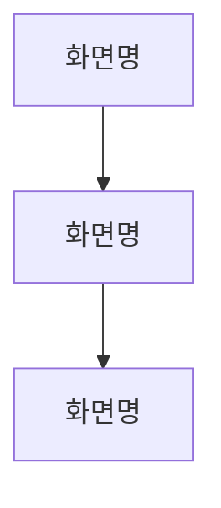

# Dou Product Design Workflow

Next.js + shadcn/ui 기반 Dou 제품 디자인 프로토타입 공통 워크플로우.

## ⓪ 정책 하네스 동기화 (모든 작업 전 필수)

설계·구현 어느 단계든 **작업을 시작하기 전에**, 이 프로젝트의 `docs/design-harness.md`를 Read 도구로 읽는다.

- **파일 있음** → 그 안의 소스 최신화 규칙(예: 기준 서비스 레포 `git pull --ff-only`)·정책 문서 참조·하네스 규칙을 그대로 따른다. pull이나 정책 읽기가 실패(로컬 변경·충돌·인증·네트워크)하면 낡은 소스로 작업하지 말고 중단·보고한다.
- **파일 없음** → 이 제품의 기준 소스 레포·정책 문서 위치를 담당자에게 물어 `docs/design-harness.md` 생성을 제안한다. 임의로 만들지 않는다.

> design-harness.md의 **내용(레포 경로·정책 위치)은 제품마다 다르며 각 제품 리포가 소유**한다. 이 스킬은 "각 프로젝트의 design-harness.md를 읽고 따른다"는 규칙만 강제한다. (제품 리포 `AGENTS.md`에도 같은 하네스 규칙이 자동 로드 컨텍스트로 실려 있을 수 있다.)

### 정책 게이트 (하네스가 연결된 제품에서 상시 적용)

동기화·통독은 정책을 **읽는** 데서 끝나지 않는다. 스펙·설계·와이어프레임·구현·수정 요청 전부에 대해, 담당자의 요청이 제품 정책(policies·issues·features·discussions 등)과 충돌하면 **그대로 실행하지 않는다.** 여기서 정책 충돌은 시각/레이아웃이 아니라 **제품 로직·도메인 규칙 차원**을 말한다.

충돌 시 순서:
1. 어떤 문서·정책과 왜 충돌하는지 **문서를 인용해 설명**한다.
2. 정책에 맞는 **대안을 제시**한다.
3. 담당자의 **확인을 받은 뒤** 진행한다.

- 예: "이 기능을 빼달라"는 요청이 정책상 필수 기능이면 빼지 말고 이유·대안을 제시. "이 유형 유저는 이렇게 동작하면 안 된다"는 정책이 있으면 그에 맞게 재설계 제안.
- 이 게이트는 "한 번 읽고 끝"이 아니라 세션 내내 유지되는 상시 제약이다. 애매하면 정책 허용 여부를 담당자에게 **먼저 되묻는다.**
- 시각/레이아웃 등 정책과 무관한 변경은 종전대로 자유롭게 반영한다.

## GitHub 작업 이슈 연결 (정책 하네스 동기화 직후)

사용자가 GitHub 이슈 링크와 함께 디자인 작업을 시작하거나, 해당 기능의 UI/UX 방향·구현 방법을 요청하면 링크된 이슈를 부모 이슈로 취급하고 `saylog-uxui-issues` 스킬을 함께 사용한다.

1. 부모 이슈와 현재 디자인 작업 범위를 확인한다.
2. `saylog-uxui-issues` 규칙에 따라 제목만 있는 디자인 하위 이슈 최종안을 보여주고 등록 승인을 받는다.
3. 승인 후 하위 이슈를 만들고 Parent issue를 연결한 다음 GitHub Project 상태를 `UI/UX Progress`로 설정한다.
4. 생성한 하위 이슈를 현재 디자인 작업의 추적 이슈로 사용한다.
5. 디자인 작업이 완료되면 최종 변경사항을 하위 이슈 본문에 정리하고 상태를 `UI/UX Done`으로 변경한다.

`UI/UX Done`은 디자인 작업 완료를 뜻하며 개발 핸드오프나 개발 준비 완료를 뜻하지 않는다. 이슈 생성·수정·관계 설정·프로젝트 상태 변경의 상세 절차와 등록 전 확인 게이트는 `saylog-uxui-issues`를 따른다.

GitHub 이슈 링크가 없으면 새 이슈를 임의로 만들지 않고 기존 디자인 워크플로우를 진행한다.

## 새 프로토타입을 시작할 때

프로토타입 저장소가 아직 없으면 **셸을 새로 짜지 않는다.** `~/projects/dou-prototype-template`을
클론해서 시작한다 — 좌측 화면 지도·기기 프레임·레이어 전환·모아 보기·설계 노트 패널이 이미
들어 있고, 제품마다 다를 이유가 없는 부분이다.

```bash
git clone ~/projects/dou-prototype-template <새 프로젝트 경로>
```

고칠 것은 셋뿐이다 — 이름·포트, `app/prototype/flows.ts`의 화면 지도, `CLAUDE.md`의
`design_config`. 자세한 건 템플릿 README에 있다.

**셸을 손으로 다시 만들면** 제품마다 조금씩 달라져서, 나중에 한 곳을 고쳐도 다른 곳에는
반영되지 않는다. 템플릿을 고쳐야 할 만큼 좋은 개선이 나오면 템플릿에 반영하고 가져온다.

## 프로젝트 구조

작업 시작 전 CLAUDE.md의 `design_config` 키를 확인한다. 없으면 담당자에게 프로젝트 경로와 설정을 물어본다.

| 항목 | 값 |
|------|-----|
| 스택 | Next.js + Bun + React + TypeScript + shadcn/ui |
| 아이콘 | `@tabler/icons-react` (`Icon*` 형식) |
| shadcn 컴포넌트 | `components/ui/` (수정 금지) |
| 제품 전용 컴포넌트 | `components/[제품명]/` |
| 로컬 실행 | `bun run dev` → 포트는 CLAUDE.md `design_config.local` (제품마다 다르다 — 예: 새록 `saylog-design`은 3100) |
| UX 라이팅 스킬 | CLAUDE.md `design_config.ux_writing_skill` |
| 디자인 시스템 | **dou-design-system 단일 기준** (위치: CLAUDE.md `design_config.design_system`) |

## 디자인 시스템 단일 기준 (필수)

모든 Dou 제품은 **`dou-design-system` 하나**를 디자인 기준으로 쓴다. 제품별 DESIGN.md·토큰·컴포넌트 세트를 **따로 만들지 않는다** (기존 제품별 DESIGN.md는 이 중앙 기준으로 대체·폐지).

작업(설계·구현) 전 dou-design-system의 다음을 읽고 그대로 따른다:
- `DESIGN.md` — 철학(친절+신뢰)·색·타이포·컴포넌트 사용 규칙·Do/Don't
- `public/ai/design-system.md` — 컴포넌트 색인 + 사용법 + variant/size
- `public/ai/tokens.json` — 토큰 값(색·Pretendard·간격·radius)
- 사용법이 더 필요하면 `src/examples/<컴포넌트>.tsx`(공식 예제)를 참조

**위치**: CLAUDE.md `design_config.design_system`에 지정(레포 로컬 경로 또는 배포 URL, 추후 `@dou/ui` 패키지). 없으면 담당자에게 묻는다.

**규칙**:
- 색·radius·간격은 dou-design-system 토큰만 사용. 제품별 임의 토큰·색 금지.
- 컴포넌트는 dou-design-system 것을 재사용. 새로 만든 컴포넌트가 재사용 가치(2+ 화면/제품·범용·대체불가) 있으면 dou-design-system에 **승격 제안**(⑥ 참조).

## 서비스 IA 지도 (읽기 + 갱신 — 작성은 이 스킬 밖)

작업 시작 전 `docs/ia.md`를 Read 도구로 읽어 서비스 전체 화면 흐름을 파악하고,
현재 화면이 전체 구조에서 어디에 위치하는지 확인한 뒤 작업을 시작한다.

**IA를 처음부터 그리는 것은 이 스킬의 일이 아니다.** IA는 "무엇을 만들지 정하는"
기획 산출물이라 `dou-product-brief` Phase 2(화면 목록 확정)에서 만들어진다.
구현된 화면을 거꾸로 훑어 IA를 지어내면 기획 의도와 어긋난 지도가 만들어진다.

`docs/ia.md`가 없을 때:

| 상황 | 처리 |
|------|------|
| 기획 폴더에 `ia.md`가 있음 | 그 파일을 `docs/ia.md`로 옮겨 온다. 새로 그리지 않는다 |
| 기획 폴더에도 없음 | 담당자에게 `dou-product-brief` Phase 2 진행을 제안한다 |
| 담당자가 "그냥 진행"이라고 함 | IA 없이 진행하되, 전체 구조 판단이 필요한 결정은 담당자에게 확인한다 |

`docs/ia.md` 형식:
```markdown
# [서비스명] IA


```

**갱신은 이 스킬의 일이다.** 새 화면을 구현한 뒤 ⑩ 커밋 전에 `docs/ia.md`
flowchart를 업데이트한다. 화면이 늘거나 흐름이 바뀌면 지도도 같이 움직여야 한다.

---

## 워크플로우

모든 화면 작업은 이 순서를 따른다. 구현부터 시작하지 않는다.

```
⓪ 정책 하네스 동기화 (작업 시작 전 · 재개 시에도 먼저)
GitHub 작업 이슈 연결 (부모 이슈 링크가 있을 때)
① 스펙 정의 (상태를 세는 것이 핵심 — 이 개수가 그릴 화면 수다)
② 화면 설계 제안
③ 와이어프레임 HTML 작성
④ UX 검토 (와이어프레임 보고)
⑤ 구조 컨펌
⑥ 구현
⑦ 타입 체크 → 오류 수정
⑧ 로컬 미리보기 → 브라우저 UX 검증 (만든 화면을 눌러 보고)
⑨ 설계 노트 작성 (다음 화면으로 넘어가기 전)
⑩ 피드백 반영 → GitHub 커밋
```

### 어디까지 밟나 — 작업 크기가 정한다

전체를 밟는 것은 **화면이 새로 생기거나 구조가 바뀔 때**다. 이미 확정된 화면을 손보는 데 스펙
표부터 다시 쓰면, 규칙이 일을 돕는 게 아니라 막는다.

**기준은 하나 — ① 스펙의 상태 목록이 바뀌는가.**

| 작업 | 밟는 단계 | 예 |
|---|---|---|
| 새 화면 · 구조 변경 · **상태가 늘거나 줄어듦** | **전체 ⓪~⑩** | 화면 신설, 흐름 재설계, 실패 상태 추가 |
| 확정된 화면의 손질 — 상태 목록은 그대로 | **⓪ → ⑥ → ⑦ → ⑧ → ⑨ → ⑩** | 간격·위계 조정, 컴포넌트 교체, 문구 한 줄, 토글 하나 추가 |
| 화면 내용과 무관한 것 | 그냥 고치고 한 줄로 보고 | 오타, 타입 오류, 접근성 속성, 리팩터링 |

손질 갈래에서도 **⑧ 브라우저 검증과 ⑨ 설계 노트는 건너뛰지 않는다.** 다만 ⑨는 새로 쓰는 게
아니라 **바뀐 항목만 고친다** — 의도나 동작 규칙이 달라졌으면 그 줄을 고치고, 겉모습만 바뀌었으면
노트는 그대로 둔다.

**애매하면 상태 목록을 세어 본다.** 세어 보니 달라졌으면 전체를 밟는다.

### 작업 재개 시 — 현재 단계 파악 먼저

재개 시에도 ⓪ 정책 하네스 동기화를 먼저 수행한 뒤, **반드시** `docs/screens/[페이지명]/README.md`를 Read 도구로 읽어 현재 단계를 확인한다.

| 문서 상태 | 재개 단계 |
|-----------|-----------|
| docs 파일 없음 | ① 부터 |
| 스펙은 있는데 **상태 목록**이 없음 | ① 부터 다시 (상태 목록이 없으면 그리지 않는다) |
| 스펙 컨펌 ✓ / 화면 설계 컨펌 미체크 | ② |
| 화면 설계 컨펌 ✓ / 구조 컨펌 미체크 | ③ 또는 ④~⑤ |
| 구조 컨펌 ✓ / 구현 미완료 | ⑥ |
| 구현 완료 / 미리보기·브라우저 검증 미확인 | ⑧ |
| 미리보기 확인 완료 / 설계 노트 없음 | ⑨ |

확인 없이 ①부터 다시 시작하거나 임의로 단계를 건너뛰지 않는다.

---

## ① 스펙 정의

화면을 만들기 전에 "이 화면이 무엇을 해야 하는가"를 먼저 확정한다.
담당자와 대화로 아래 항목을 채운 뒤, 정리해서 컨펌을 받는다.

| 항목 | 내용 |
|------|------|
| **목적** | 이 화면이 해결하는 문제 |
| **사용자** | 누가, 어떤 상황에서 사용하는가 |
| **주요 기능** | 이 화면에서 할 수 있는 것 (우선순위 순) |
| **엣지 케이스** | 데이터 없음, 오류, 권한 없음 등 |
| **제약 조건** | 필수/선택 항목, 최대 개수, 권한 등 |
| **성공 기준** | "몇 탭 안에 ~를 할 수 있어야 한다" 형태로 |
| **상태 목록** | 이 화면에 있을 수 있는 상태를 **하나씩 적어 센다** — 기본·빈·로딩·실패·권한 없음·부분 실패. **이 개수가 곧 ③에서 그려야 할 화면 수다** |
| **다루지 않는 것** | 이 화면의 범위 밖. 적지 않으면 화면이 비대해진다 |

**상태 목록이 이 표의 핵심이다.** 화면부터 그리기 시작하면 정상 상태만 있는, 예쁘지만 쓸 수
없는 결과가 나온다. 상태를 세는 것이 그걸 막는 유일한 장치다.

### 상태는 머리로 짜내지 않는다 — 뽑아 온다

내가 만든 목록을 내가 검토하는 구조라, **내가 못 본 상태는 어느 단계에서도 안 잡힌다.** 그래서
상태는 상상하지 말고 근거에서 뽑는다.

**이미 있는 화면이면 — 실제 앱 소스의 분기에서 뽑는다.**

기존 구현이 갈라지는 자리가 곧 상태다. ⓪에서 최신화해 둔 소스에서 그 화면의 파일을 열고 훑는다.

| 소스에서 찾을 것 | 그것이 만드는 상태 |
|---|---|
| 로딩·에러 처리 (`isLoading` · `error` · try/catch) | 로딩 · 실패 |
| 목록이 비었을 때의 분기 (`isEmpty` · `length === 0`) | 빈 |
| 권한·역할·연동 여부로 갈리는 곳 | 권한 없음 · 연동 시/미연동 |
| 진행 단계를 나타내는 값 (status · phase enum) | 그 값의 개수만큼 |
| 조건부 렌더 (`&&` · 삼항) | 그 조건이 참일 때/거짓일 때 |

**앱에 이미 있는데 안 센 상태**가 가장 흔한 누락이고, 이 방법으로 대부분 사라진다.

**새로 기획하는 화면이면 — 무엇이 상태를 만드는지로 뽑는다.**

소스가 없으니 원인에서 거꾸로 센다.

| 물을 것 | 생기는 상태 |
|---|---|
| 이 화면의 데이터는 **어디서 오나** — 서버에서 오나, 이미 손에 있나 | 서버에서 오면 로딩·실패·빈이 자동으로 생긴다 |
| **정책이 막는 것**이 있나 — 권한·연동·기관 제한 | 막힌 상태 (그리고 왜 막혔는지 말하는 자리) |
| **시간이 걸리는 동작**이 있나 | 진행 중 · 지연 · 부분 완료 · 취소 |
| 같은 제품에 **비슷한 화면**이 있나 | 그 화면의 상태 목록을 가져와 이 화면에 있을 것만 남긴다 |

**마지막으로 둘 다 디자인 시스템의 여섯 상태로 점검한다** (기본·빈·로딩·실패·권한 없음·부분 실패).
없는 것은 "이 화면엔 없다"고 한 줄 적는다 — 안 적으면 뺀 건지 잊은 건지 알 수 없다.

### 답은 내가 먼저 쓴다

빈 표를 담당자에게 내밀지 않는다. 아래에서 찾을 수 있는 것은 채워 두고 확인만 받는다.

| 어디서 답이 나오나 | 예 |
|---|---|
| 제품 정책(Wiki)·하네스 | 무엇을 해도 되고 안 되는지, 도메인 규칙 |
| 기존 화면·소스 코드 | 지금 어떻게 동작하는지, 상태가 실제로 몇 개인지 |
| 디자인 시스템 | 어느 표면인지에 따른 밀도·자리 |
| 이전 대화·이슈 본문 | 이번에 왜 하는지, 성공 기준 |

**담당자에게 묻는 것은 답이 갈리면 결과물이 달라지는 것뿐이다** — 기능 범위(넣을까 뺄까),
정책·규칙 결정, 화면 구조 선택. 나머지는 답을 적어 두고 진행하되, **근거가 약한 답에는
`(가정)`을 붙인다** — ⑤ 구조 컨펌에서 함께 확인받는다.

아무것도 안 하고 되묻지 않는다. 물어야 할 게 있으면 **먼저 할 수 있는 것을 다 해놓고**
그 지점에서 묻는다.

컨펌 형식: 위 표를 채운 뒤 `→ 이 스펙으로 설계 진행할까요?`로 마무리. **`(가정)`으로 표시한 것이
있으면 그것만 따로 짚어 묻는다** — 표 전체를 다시 읽게 하지 않는다.

**컨펌 후 즉시:** `docs/screens/[페이지명]/README.md` 파일을 생성하고 스펙 표와 진행 상황 체크리스트를 저장한다.
```markdown
# [화면명]

## 스펙
[스펙 표]

## 진행 상황
- [x] 스펙 컨펌 (상태 목록 포함)
- [ ] 화면 설계 컨펌
- [ ] 구조 컨펌
- [ ] 구현
```

**이 생각이 들면 멈춰라:**

| 생각 | 현실 |
|------|------|
| "방향을 이미 말해줬으니 스펙 정의 생략 가능" | 방향 ≠ 스펙. 엣지 케이스·제약 조건은 별도 확인이 필요하다. |
| "간단한 화면이라 스펙 없이 해도 되겠지" | 간단해 보여도 요구사항이 다를 수 있다. 항상 확인해라. |
| "컨펌은 받았는데 docs는 나중에 써도 되겠지" | 지금 안 쓰면 잊는다. 컨펌 즉시 저장해라. |

---

## ② 화면 설계 제안 (= UX 설계)

**스펙 컨펌 후 진행한다. ②는 UX 설계 — 디자이너가 소유하는 경험(LOCK)을 정한다:** 화면 요소·그룹핑·정보 위계, **플로우·상태·인터랙션(언제 무엇이 일어나나)·엣지/에러**. 컴포넌트 선택·간격·색 같은 **UI(시각·OPEN)는 여기서 정하지 않고** ⑥에서 디자인 시스템 기준으로 정한다.

**먼저 읽기:** dou-design-system `DESIGN.md`(디자인 철학·Do/Don't) — 어떤 결이어야 하는지 감을 잡는다. (컴포넌트 색인·토큰 `public/ai/*`은 시각을 정하는 ⑥/개발팀 단계에서 읽는다.)

**REQUIRED SUB-SKILL:** UI 문구(버튼 라벨, 빈 상태 텍스트, 에러 메시지 등)가 포함될 때는 반드시 CLAUDE.md `design_config.ux_writing_skill`에 지정된 스킬을 Skill 도구로 invoke하여 작성한다. 그 키가 비어 있으면 임의로 비슷한 이름의 스킬을 고르지 말고 담당자에게 어느 스킬을 쓸지 묻는다 — 제품마다 톤이 다르고, 이름이 비슷한 범용 스킬이 정반대 규칙을 들고 있는 경우가 있다.

### 이 단계의 문구는 임시다

와이어프레임에 들어갈 문구는 ux-writing 스킬로 쓰되 **확정이 아니다.** 구조를 합의하는 자리라
문구는 "이 자리에 이런 말이 온다"까지만 하면 된다.

**기존 앱 문구와의 대조는 ⑥ 구현에서 한다.** 여기서 미리 대조하면, 아직 살아남을지도 모르는
화면의 문구까지 전부 뒤지게 된다 — 구조가 바뀌면 그 시간이 통째로 버려진다.

**이 생각이 들면 멈춰라:**

| 생각 | 현실 |
|------|------|
| "버튼 라벨이 간단하니 ux-writing 스킬 생략해도 되겠지" | 간단한 문구일수록 톤·종결어미 실수가 난다. 항상 invoke해라. |
| "구조만 보는 거니 아무 말이나 넣어도 되겠지" | 임시라도 그 자리에 올 말이어야 구조가 맞는지 보인다. Lorem ipsum은 안 된다. |
| "더 나은 문구가 떠올랐으니 그냥 쓰면 되지" | 더 나은지는 담당자가 정한다. 출고된 문구를 바꾸는 건 제품을 바꾸는 것이다 — ⑥에서 대조하고 목록에 올려라. |

설계 제안은 구체적이어야 한다 — 추상적으로 "목록을 보여준다"가 아니라 "상단에 날짜·환자명, 아래에 기록 행 반복, 각 행에 상태 배지, 하단에 기록 시작 버튼"처럼 **요소·배치·순서·상태**를 짚는다. 인터랙션 흐름, 빈/에러/로딩 상태, 제품 surface(모바일 전용/웹/둘 다)에 따른 레이아웃도 설명한다. **컴포넌트 이름·간격·색은 쓰지 않는다**(그건 ⑥/개발팀).

**컨펌 후 즉시:** `docs/screens/[페이지명]/README.md`에 화면 설계 내용을 추가하고 진행 상황을 업데이트한다.

---

## ③ 구조 시각화 — 와이어프레임

**저장 위치:** `docs/screens/[페이지명]/wireframe.html` — 문서(README.md)와 **같은 폴더**에 둔다(화면별 한 폴더).
→ 확인: 그 HTML을 브라우저로 **바로 연다**(dev 서버 불필요; Tailwind CDN 쓰므로 인터넷만 있으면 됨).

**REQUIRED:** 작성 전 Read 도구로 `~/.claude/skills/dou-product-design/wireframe-guide.md`를 읽는다. 제품에 별도 wireframe-guide가 있으면 그것도 함께 읽는다.

**CSS 규칙:** 와이어프레임 HTML은 **Tailwind CSS CDN + 유틸리티 클래스**로 작성한다. `<style>` 블록에 raw CSS를 작성하지 않는다. `@keyframes`와 `body { font-family }` 한 줄만 예외 허용.

**REQUIRED SUB-SKILL:** 와이어프레임 안의 모든 UI 문구(버튼 라벨, 빈 상태 텍스트, 배너 메시지, 안내 문구 등)는 반드시 지정된 ux-writing 스킬을 Skill 도구로 invoke하여 작성한다.

**핵심 규칙 (전체 상세는 wireframe-guide.md 참조):**
- **화면 상태를 번호로 나누되, 메인 플로우는 좌→우 가로 스트립(`→` 연결)·예외는 아래 세로. 프레임은 제품 surface에만(모바일 전용이면 모바일만)** — 상세 wireframe-guide.md
- 실제 UI 문구 그대로 사용 (Lorem ipsum 금지)
- 고정 요소는 `※ 고정` 주석 표기
- **와이어프레임은 순수 구조-합의용으로 유지** — 데이터·동작규칙·정책 등 구조 외 상세는 `docs/screens/[페이지명]/README.md`에 담는다

작성 후:
1. `docs/screens/[페이지명]/wireframe.html 파일을 열어 확인해 주세요` 전달
2. `docs/screens/[페이지명]/README.md` 파일 상단(제목 바로 아래)에 와이어프레임 링크 추가:
   ```markdown
   **와이어프레임:** [`./wireframe.html`](./wireframe.html) — 같은 폴더. ⑤ 구조 컨펌 시점의 기록.
   ```

### 와이어프레임의 수명 — ⑥ 구현에 들어가면 끝난다 (필수)

와이어프레임은 **⑤ 구조 컨펌을 받기 위한 도구**다. 컨펌이 끝나고 ⑥ 구현으로 넘어간 순간
**그 시점의 합의 기록으로 동결**되고, 이후로는 유지보수 대상이 아니다.

⑥ 이후에 들어오는 모든 피드백은 **구현 코드와 `README.md`에만** 반영한다.

- 와이어프레임 HTML을 고치지 않는다.
- **"와이어프레임도 갱신할까요?"를 묻지 않는다.** 묻는 것 자체가 담당자의 시간을 쓴다.
- 화면이 와이어프레임과 달라졌다는 사실을 보고하지 않는다 — 달라지는 게 정상이다.
- 진행 상황 체크리스트의 `구조 컨펌`이 체크돼 있으면 이미 동결된 것으로 본다.

**단 하나의 예외**: 담당자가 **명시적으로** 와이어프레임 갱신을 요청한 경우. 그때만 고친다.

구조 자체가 뒤집히는 큰 변경(화면이 통째로 새로 설계되는 수준)이라면 와이어프레임을 고치는
게 아니라 ①~⑤를 다시 밟을 일이다 — 그건 담당자가 정한다.

---

## ④ UX 검토

와이어프레임 작성 후 자동으로 수행한다. 별도 요청 없이 진행. **두 렌즈로 본다.**

**A. UX·플로우:**
- **상태 완결성** — **① 스펙의 상태 목록과 한 줄씩 대조한다.** 센 개수만큼 실제로 그려져 있는가
- **전이 명확성** — 모든 전이에 "누가"(사용자 턴/시스템 턴)가 분명한가, 자동 vs 사용자 확인(게이트)이 안 헷갈리는가
- **엣지·에러·되돌리기** — 실패·취소·재진입·loop-back·빈 입력이 처리됐는가
- **로직 일관성** — 와이어프레임 ↔ 카피 ↔ 상태표가 서로 어긋나지 않는가
- **유저 저니** — 목표까지 흐름이 매끄럽고 군더더기 없는가(① 성공 기준 대비)

**B. UI·레이아웃:** 값은 여기 적지 않는다 — **디자인 시스템이 주인**이고, 그 문서(`design_config.design_system`의 `DESIGN.md`)를 열어 대조한다.

- **터치·안전영역** — DESIGN.md 터치·안전영역 절 기준으로 확인
- **접근성** — 대비·포커스·색만으로 전달 금지. DESIGN.md 접근성 절 기준
- **모션** — 지속시간·이징이 DESIGN.md 모션 절의 단계 안에 있는가, 모션 줄이기를 존중하는가
- **정보 위계 · 액션 명확성** — 중요한 것이 먼저 보이는가, Primary가 화면당 하나인가
- **반응형** — 제품 surface에 맞는 레이아웃인가

> **UX 결함(전이·상태·로직)은 UI 체크로 안 잡힌다 — A를 먼저 수행하고 B를 이어서 수행한다.**

### 찾은 것은 심각도를 붙여 적는다

평평하게 나열하면 지금 고칠 것과 나중에 다듬을 것이 안 갈린다. **⑧ 브라우저 검증도 같은 세 단계를 쓴다.**

| 표시 | 뜻 | 처리 |
|---|---|---|
| 🔴 막힘 | 할 일을 못 하거나, 사람을 잘못 이끌거나, 내용·조작이 아예 닿지 않는다 | 넘기기 전에 고친다 |
| 🟠 중요 | 되긴 되는데 이해나 속도가 눈에 띄게 나빠진다 | 이번 작업 안에서 고친다 |
| 🟡 다듬기 | 한 자리에만 있는 손질거리 | 남겨 두고 담당자가 정한다 |

한 항목은 **무엇 · 왜(한 줄) · 어떻게 고치나(구체적으로)** 세 조각으로 적는다.
**한 번에 15개를 넘기지 않는다** — 그보다 많으면 🔴·🟠부터 내고 나머지는 "이 밖에 다듬기 N건"으로 묶는다.

### 이건 발견 즉시 🔴 (판단하지 않는다)

값이 아니라 **조건**이라 DESIGN.md와 부딪히지 않는다. 값은 여전히 DESIGN.md가 주인이다.

- 누를 수 있는 것에 **이름이 없다**(스크린리더가 읽을 게 없다)
- Tab으로 갈 수 있는데 **포커스가 안 보인다**
- 마우스로는 되는데 **키보드로는 못 하는 길**이 있다
- **색만으로** 뜻을 전한다(상태·오류·선택)
- 320px 폭이나 200% 확대에서 **내용이 잘리거나 닿지 않는다**
- 지우기·되돌릴 수 없는 동작에 **확인 절차나 구분되는 생김새가 없다**
- 잘린 글자의 **전체 내용을 볼 길이 없다**
- 오류가 났는데 **빠져나갈 길이 없다**
- 상태가 바뀐 것을 **움직임으로만** 알린다
- 모션이 **모션 줄이기 설정을 무시**한다

이슈 없으면 "UX 검토 완료 — 이슈 없음" 명시. 이슈 있으면 수정 후 전달.

---

## ⑤ 구조 컨펌

```
## 구조 컨펌: [화면명]
폴더: docs/screens/[페이지명]/ (README.md + wireframe.html)

### 확인이 필요한 가정
[① 스펙에서 `(가정)`으로 표시한 항목. 없으면 이 섹션 자체를 뺀다]

### UX 검토 결과
[이슈 목록 또는 "이슈 없음"]

→ 이 구조로 구현을 진행할까요?
```

**컨펌 전에는 절대 React 코드를 작성하지 않는다.**

> 이 컨펌은 **구조(LOCK)** 에 대한 합의다 — 화면 요소·그룹핑·정보 위계·플로우·상태. 간격·색·컴포넌트 선택 등 **시각(OPEN)** 은 ⑥에서 디자인 시스템으로 새로 정한다. (⑥의 LOCK/OPEN 계약 참조)

**이 생각이 들면 멈춰라:**

| 생각 | 현실 |
|------|------|
| "간단한 수정이라 바로 해도 되겠지" | 간단해 보여도 설계 의도가 다를 수 있다. 항상 물어봐라. |
| "방향을 이미 말해줬으니 와이어프레임 생략 가능" | 방향 ≠ 컨펌. 와이어프레임으로 눈으로 확인해야 한다. |
| "빠르게 만들어 보여주고 피드백 받으면 되지" | 구현 후 피드백은 수정 비용이 크다. 와이어프레임 먼저. |

---

## ⑥ 구현

컨펌 후 React 컴포넌트를 작성한다. **단, 와이어프레임을 픽셀로 베끼지 않는다.**

### 장치 1 — 와이어프레임 LOCK / OPEN 계약 (필수 인지)

와이어프레임이 **확정한 것(LOCK)** 과 **구현이 디자인 시스템으로 새로 정하는 것(OPEN)** 을 구분한다. 구현은 LOCK만 따르고, OPEN은 DS 기준으로 **재설계**한다.

| LOCK — 반드시 따름 | OPEN — 구현이 DS로 새로 결정 |
|---|---|
| 화면에 존재하는 요소 목록 | 정확한 간격·여백·정렬 |
| 요소 그룹핑 | 컴포넌트 선택 |
| 정보 위계(순서) | 색·타이포·radius·밀도·그림자 |
| 사용자 플로우 | 시각적 표현 전부 |
| 화면 상태(빈/에러/로딩) | |

> 와이어프레임은 그레이스케일 **구조 합의**일 뿐 시각 정답이 아니다. 박스 크기·간격·스타일을 그대로 옮기면 안 된다.

### 장치 2 — 색인·토큰 읽기 → 매핑 (React 작성 전 필수)

**먼저 컴포넌트 색인(`public/ai/design-system.md` 또는 제품이 지정한 파일)과 `DESIGN.md`의
토큰 절(타이포·색·간격·radius)을 처음부터 끝까지 읽는다.**

②에서 읽는 `DESIGN.md`는 철학·Do/Don't까지다. **토큰 표는 여기서 읽는다** — 앞부분만 읽고
멈추면 "타이포 유틸이 있다"는 것만 알고 어느 자리에 무엇을 쓰는지는 모른 채 시작하게 된다.
실제로 그렇게 화면 전체가 한 계단 작아진 적이 있다(`text-label`을 메타마다 붙였는데 그건
12px/weight 600인 **섹션 라벨 전용**이었고, DESIGN.md 타이포 절에 "메타데이터 `text-caption`,
섹션 라벨 `text-label`"이라고 그대로 적혀 있었다).

**실제 앱 화면을 프로토타입으로 옮기는 작업이면 타이포 매핑도 적는다.** 소스의 `fontSize`·
`fontWeight`를 뽑아 토큰에 대응시킨다 — 눈대중으로 고르면 한두 단계씩 어긋난다.

```
앱 소스                        → 토큰
이름 16/600                    → text-title
지시 내용 미리보기 13/400        → text-caption
섹션 헤더 14/600                → text-body-sm + font-semibold
```

**그리고 한 자리에서 틀린 토큰을 찾았으면 같은 종류의 자리를 전부 훑는다.** 한 군데만 고치면
화면마다 다른 크기가 남는다.

- **`grep`으로 아는 이름만 확인하지 않는다.** grep은 이름을 아는 것만 걸린다. 색인을 안 읽으면
  `ListItem`·`BottomActionBar`·`EmptyView` 같은 게 있는지조차 모른 채 손으로 만들게 되고,
  그러면 아래 매핑 단계도 **매핑할 목록이 없어서 통째로 증발한다.** 실제로 그렇게 어긋난 적이 있다.
- 이미 읽었더라도 화면이 바뀌면 다시 훑는다 — 이번 화면에 필요한 게 저번과 다르다.

그 다음, 와이어프레임의 각 영역을 **어떤 DS 컴포넌트/패턴으로 매핑할지 적고 담당자에게 보여준다.**
구현의 출발점을 "와이어프레임"이 아니라 "DS 컴포넌트"로 바꾸는 차단막이다. 혼자 적고 넘어가면
건너뛴 걸 아무도 모른다 — 보여줘야 이 단계가 실제로 작동한다.

```
와이어프레임 상단 박스   → PageHeader
중간 반복 행            → ListItem (density: 웹 compact / 앱 comfortable)
하단 큰 버튼            → BottomActionBar(floating) + Button(default)
빈 화면                → EmptyView
```

매핑이 끝나면 **그 컴포넌트들의 기본 스타일·밀도 규칙으로 레이아웃을 새로 짠다** — 와이어프레임을 보고 그리지 않는다.

### 이름으로 짐작하지 말고 값을 연다

컴포넌트든 토큰이든 **처음 쓰는 것은 실제 값을 확인한 뒤에 쓴다.** 이름이 뜻을 다 말해 주지
않는다. 실제로 어긋난 적이 있다.

| 짐작 | 실제 |
|---|---|
| `text-label` — "라벨이니 작은 글씨" | 12px **weight 600**. 섹션 라벨용이라 메타에 쓰면 볼드하게 읽힌다. 메타는 `text-caption`(13/400) |
| `Card` — "카드니까 안쪽 여백이 있겠지" | 세로 여백만 있다. 좌우는 `CardContent`가 준다 — 안 쓰면 내용이 가장자리에 붙는다 |
| `BottomActionBar floating` — "떠 있는 버튼" | `[&>button]:flex-1`이라 폭을 꽉 채운다. 우측 FAB이 아니다 |
| `MobileScreen` — "header랑 children만 있겠지" | `bottom` 슬롯이 따로 있다. 본문에 넣은 고정 요소는 스크롤 끝으로 밀린다 |

확인하는 법은 간단하다 — 타입 정의(`*.d.ts`)를 열거나 토큰 파일에서 그 이름을 찾는다. 몇 초면
끝나고, 안 하면 화면을 만든 뒤에 되돌리게 된다.

**대체할 DS 컴포넌트가 없어 직접 만들 때는 그 사실과 이유를 적는다.** 매핑 표에 한 줄로 남기고,
만든 파일 맨 위에도 쓴다 — "무엇으로 대체하려 했는데 무엇이 막아서 직접 만들었는가". 그래야
DS 승격 제안이 근거를 갖는다(예: `ListItem`의 `title`이 `string`이라 이름 옆 칩을 못 넣는다 →
`ReactNode`로 넓히자). 이유 없이 직접 만든 컴포넌트는 그냥 규칙을 어긴 것과 구분되지 않는다.

**만들기 전에 — 고치는 순서는 싼 것부터다:**

| 순서 | 방법 | 왜 |
|---|---|---|
| 1 | **지운다** — 이 요소가 없어도 되는지 먼저 본다 | 안 만든 것은 어긋날 일도, 유지할 일도 없다 |
| 2 | **기본값을 쓴다** — 플랫폼·브라우저가 이미 해 주는 동작(폼 검증, 포커스 순서, 스크롤) | 손으로 만들면 접근성이 같이 사라진다 |
| 3 | **있는 것을 쓴다** — 디자인 시스템 컴포넌트·토큰 |  |
| 4 | **값을 고친다** — 있는 컴포넌트에 맞는 variant·size·토큰으로 바꾼다 |  |
| 5 | **새로 만든다** — 위 넷이 다 막혔을 때만 |  |

1번이 이 표의 핵심이다. **요소를 빼는 게 가장 싼 해결인데, 선택지에 없으면 떠오르지 않는다.**
④ UX 검토에서 나온 이슈를 고칠 때도 같은 순서로 본다.

**컴포넌트 선택 우선순위(위 3~5단계의 상세):**

| 우선순위 | 방법 |
|---------|------|
| 1 | `components/ui/`(shadcn)·`components/dou/`(디자인 시스템 패턴)·`components/[제품명]/`에 있는 컴포넌트를 그대로 사용 |
| 2 | 없으면 디자인 느낌이 유사한 컴포넌트로 대체 |
| 3 | 대체 불가능하면 새 컴포넌트 만들어 등록 — 재사용 가치(2+ 화면/제품·범용·대체불가)가 있으면 **디자인 시스템 승격을 제안** |

**비주얼 디자인 방식:**
별도 Figma 디자인 없이 **dou-design-system의 컴포넌트·토큰**(`design-system.md`·`tokens.json`, 필요 시 `src/examples/*`) 기반으로 구현한다. 로컬 미리보기(⑧)에서 시각적 피드백을 받아 반영한다.

**규칙:**
- 모든 색상은 CSS 토큰 사용 (`bg-primary`, `text-muted-foreground` 등) — 하드코딩 금지
- 컴포넌트는 `components/ui/`의 shadcn 컴포넌트 우선
- **컴포넌트는 기본 스타일 그대로 사용한다 — `className`으로 임의 덮어쓰기 금지.** 스타일 변경이 필요하면 담당자에게 먼저 물어본다.
- 빈 상태 UI 반드시 구현
- 반응형 구현 — 제품 surface에 맞게(모바일 전용이면 모바일만)

**디자인 인스펙터 자동 추가:**
제품이 `@dou/ui`를 사용(디자인 시스템 연동)한다면, 앱 루트 레이아웃에 `<DesignInspector />`를 한 번 추가한다(이미 있으면 생략). 모든 프로토타입 화면에서 "쓴 컴포넌트 + 상태 + 위치"를 디자이너가 바로 확인할 수 있게 하기 위함이다. 개발 환경에서만 노출한다.
```tsx
import { DesignInspector } from "@dou/ui"
// 루트 레이아웃(예: app/layout.tsx)에서, 개발 중에만:
{process.env.NODE_ENV === "development" && <DesignInspector catalogBaseUrl="<디자인시스템-사이트-URL>" />}
```
제품이 아직 `@dou/ui`를 연동하지 않았다면 생략한다(import 불가).

**REQUIRED SUB-SKILL:** 구현 중 `make-interfaces-feel-better` 스킬을 Skill 도구로 invoke하여 폴리시 원칙(border radius, animations, typography 등)을 적용한다.

**화면 간 통일성 — 반복 패턴 추출:**
구현 전, 이 화면에서 다른 화면에도 반복될 패턴이 있는지 먼저 파악한다. 반복될 패턴은 `components/[제품명]/` 하위에 공용 컴포넌트로 추출한다.

예: `PageHeader` (제목 + 우측 액션), `ListItem` (목록 행), `EmptyView` (빈 상태)

**구현 후 반드시 점검:**
구현이 끝나면 디자인 시스템 컴포넌트를 쓰지 않고 직접 만든 요소가 있는지 확인한다.
- 직접 만든 요소가 있으면 담당자에게 알린다
- 두 개 이상의 화면에서 반복될 것 같으면 `components/[제품명]/`에 등록할지 물어본다

**컴포넌트 위치 구분:**

| 종류 | 위치 | 예시 |
|------|------|------|
| shadcn 원자 컴포넌트 | `components/ui/` | `Button`, `Badge`, `Input` |
| 제품 범용 레이아웃 | `components/[제품명]/` | `PageHeader`, `EmptyView` |
| 제품 도메인 특화 | `components/[제품명]/` | 제품별 엔티티 카드/아이템 |

---

### 장치 3 — 문구 확정 (화면에 글자를 넣기 전)

와이어프레임의 문구는 임시다. 실제 화면에 넣는 문구는 여기서 정한다.

**순서는 하나다 — 있으면 쓰고, 없으면 짓는다.**

| 겹 | 확인할 것 | 방법 |
|---|---|---|
| 1겹 — 같은 자리 | 지금 만드는 화면에 **이미 쓰이는 문구** | ⓪에서 최신화한 구현 소스와 baseline 캡처에서 그 화면을 찾아 문구를 그대로 읽는다 |
| 2겹 — 같은 개념 | 이 화면에 **새로 등장하는 개념**을 다른 화면은 뭐라 부르는지 | 구현 소스를 개념어로 검색한다 |

- 1겹에서 찾았으면 **그것이 기본값이다.** 바꿀 이유가 있을 때만 바꾼다.
- 대조 대상이 없는 새 문구는 ux-writing 스킬 규칙대로 짓는다.
- 대조는 **이 화면이 실제로 쓰는 문구만** 한다. 화면 전체를 훑지 않는다.
- 미리 만든 문구 사전은 두지 않는다 — 앱이 문구를 바꾸는 순간 사전이 거짓말을 시작한다.

**출고된 문구를 바꾸게 되면 목록으로 모은다.** ⑧에서 화면과 함께 한 번 확인받는다.

| 자리 | 기존 앱 | 변경안 | 이유 |
|---|---|---|---|
| [화면·요소] | [출고 중인 문구] | [새 문구] | [왜 바꾸는지] |

달라진 게 없으면 표를 만들지 않는다. 아무 말도 없으면 "기존 그대로"라는 뜻이어야 읽는 사람이
안심한다.

---

## ⑦ 타입 체크 → 오류 수정

```bash
bun run typecheck
```

오류가 있으면 담당자에게 전달하기 전에 모두 수정한다.

---

## ⑧ 로컬 미리보기 → 브라우저 UX 검증

`localhost:<포트>/[페이지경로]` 에서 담당자가 직접 확인. 포트는 CLAUDE.md `design_config.local`을 따른다 — 3000으로 단정하지 않는다.

한 저장소가 제품 여러 개를 담기도 한다. 그때는 제품 경로까지 적는다 (예: 새록 `saylog-design`은 `/mobile` · `/desktop` · `/web`).

### 브라우저는 처음 한 번만 열어준다

담당자는 디자이너다 — 주소를 복사해 붙여넣게 하는 것 자체가 확인 진입 장벽이다. 그래서
**아직 볼 자리가 없을 때는 열어준다**(macOS는 `open "<url>"`). dev 서버가 꺼져 있으면 먼저
띄운 뒤 연다.

**단, 이미 열려 있으면 다시 열지 않는다.** dev 서버는 대개 Fast Refresh(HMR)라 **저장하는
순간 열려 있는 탭이 알아서 갱신된다.** 고칠 때마다 `open`을 부르면 탭만 쌓이고, 담당자가
띄워 두고 작업하던 자리를 잃는다.

| 상황 | 어떻게 |
|---|---|
| 이 세션에서 아직 안 열었다 | 연다 |
| 이미 열었고 같은 화면을 고쳤다 | **열지 않는다.** 무엇이 바뀌었는지만 전한다 |
| 이미 열었지만 **다른 화면**을 봐야 한다 | 열지 않고 URL을 글로 적어 준다(화면을 지정하는 쿼리가 있으면 그것까지) |
| 담당자가 "다시 열어달라"고 했다 | 연다 |

담당자가 탭을 새로 여는 걸 싫어한다고 말한 적이 있으면 그 말이 이 규칙보다 우선한다.

### 브라우저 검증 (구현 후 · 담당자에게 넘기기 전)

④ UX 검토는 와이어프레임을 보고 하는 것이라, 구현하면서 생긴 문제는 잡지 못한다. **만든 화면을
브라우저로 직접 열어** 아래 순서로 확인한 뒤 넘긴다. 코드를 읽어서 판단하지 않는다 — 눌러 보고
판단한다.

1. **주 흐름을 끝까지 눌러 본다.** 시작부터 완료까지. 중간에서 뒤로 가 보고, 취소해 보고,
   다시 들어와 본다.
2. **상태를 하나씩 열어 본다.** ① 스펙의 상태 목록 그대로. 빈·로딩·실패·권한 없음이
   실제로 그려져 있는지, 빈 화면이 그냥 흰 화면은 아닌지.
3. **작은 화면에서 본다.** 폭을 좁혀(375px 기준) 잘리거나 가로 스크롤이 생기지 않는지.
4. **키보드로 훑는다.** Tab으로 이동했을 때 포커스가 보이는지, 고정 바에 가리지 않는지,
   다이얼로그에서 `Esc`로 닫히는지.
5. **눌러 본 것과 문서를 대조한다.** 설계 노트·스펙과 실제 동작이 어긋나면 둘 중 하나가 틀린 것이다.

찾은 것은 **무엇을 하다가 무엇이 보였는지**로 적는다("접근성 미흡" ✗ → "환자 미연결 탭에서
연결하면 목록에 그대로 남아 있다" ○).

**심각도는 ④와 같은 세 단계를 쓴다**(🔴 막힘 / 🟠 중요 / 🟡 다듬기). ④의 "발견 즉시 🔴" 목록도
그대로 적용된다 — 오히려 여기서 더 잘 걸린다. 와이어프레임에는 없던 포커스·키보드·좁은 폭이
실제 화면에서야 드러나기 때문이다. **🔴은 담당자에게 넘기기 전에 고친다.**

**찾은 것을 어디에 두나:**

| 종류 | 어떻게 |
|---|---|
| 내가 고칠 수 있는 것 | 고치고 넘긴다. 아래 수정 화면 요약표의 `볼 것`에 그 변화를 적는다 |
| 판단이 필요한 것 (범위·정책·구조) | 고치지 않고 요약표 **아래에 목록으로** 붙인다 — `무엇을 하다가 무엇이 보였는지 · 어떻게 하면 좋을지` |
| 이번 화면 밖의 문제 | 여기서 고치지 않는다. 이슈로 남길지 담당자에게 한 줄로 묻는다 |

브라우저를 띄울 수 없는 상황이면(도구 권한 없음·서버가 안 뜸) **그 사실을 말하고 넘긴다.**
검증했다고 하지 않는다 — 안 한 검증을 했다고 적는 것이 가장 나쁘다.

**아무것도 못 찾았으면 "브라우저 검증 완료 — 이슈 없음"이라고 적는다.** 검증을 했는지 안 했는지가
보이지 않으면 다음 사람이 다시 한다.

> 열려 있는 탭이 있으면 그 탭에서 확인한다. 확인하려고 탭을 새로 열지 않는다(⑧ 위 규칙).

### 수정 화면 요약표 (확인 안내의 기본 형식)

확인을 요청하는 메시지는 긴 설명 대신 **"어떤 화면을 수정했고 어디서 보는지"가 한눈에
들어오는 표**로 시작한다. 변경 내용을 산문으로만 풀면 담당자는 무엇을 열어야 하는지부터
다시 물어보게 된다.

| 수정 화면 | 위치 (여는 경로) | 볼 것 |
|---|---|---|
| [화면 이름 — 담당자가 부르는 이름] | [좌측 패널 경로·상태 칩·진입 버튼 등 실제 클릭 순서] | [확인해야 할 변화 1~3개] |

- 수정한 화면이 여러 개면 행을 늘린다. 화면 하나 안의 세부 상태(상태 칩 등)는 행을
  쪼개지 말고 "볼 것"에 담는다.
- 표 아래에 상세 설명을 붙이는 건 자유지만, 표 없이 산문만 보내지 않는다.
- ⑥에서 모은 **문구 변경 목록이 있으면 이 표 아래에 함께 붙인다.** 여기가 문구를 확인받는
  **유일한 자리**다 — 화면을 보면서 판단하는 게 표만 보는 것보다 정확하다.
- 출고된 문구를 바꾼 게 없으면 아무것도 묻지 않는다. 없는 걸 확인시키면 담당자 시간만 쓴다.

---

## ⑨ 설계 노트 작성 (다음 화면으로 넘어가기 전 필수)

화면을 다 만들었으면 **그 화면이 왜 그렇게 생겼고 어떻게 움직여야 하는지**를 적고 넘어간다.
다음 화면으로 옮겨간 뒤에는 판단의 근거가 기억에서 빠르게 사라진다 — 그림만 남으면 받는
쪽은 "무엇을 그릴지"만 알고 "왜"와 "어떻게 움직일지"는 모른 채 만든다.

**적는 자리 (둘 중 하나, 프로토타입 쪽이 우선):**

| 상황 | 어디에 |
|---|---|
| 프로토타입에 설계 노트 자리가 있다 | 그 파일에 화면 키로 등록한다. 새록은 `app/mobile/prototype/design-notes.ts` · `app/desktop/design-notes.ts` · `app/web/_components/design-notes.ts` |
| 그런 자리가 없다 | `docs/screens/[페이지명]/README.md` 에 `## 설계 노트` 절로 같은 네 항목을 쓴다 |

**항목은 넷으로 고정한다.** 자유 서술로 두면 사람마다 다른 것을 적어 견줄 수가 없다.

| 항목 | 담는 것 |
|---|---|
| 의도 | 왜 이렇게 했는지 · 무엇을 막으려 한 것인지. **기각한 대안과 그 이유**까지. 문구를 왜 그렇게 썼는지도 여기 |
| ㄴ **주의** | **작업 순서를 적는 자리가 아니다** — 아래 `의도는 결과의 이유만 적는다` 참조 |
| 동작 규칙 | 무엇을 누르면 무엇이 되는지 · 언제 못 누르는지 · 어디로 돌아가는지 |
| 움직임 | 전환·나타남·사라짐. 몇 밀리초에 어떤 느낌으로. 방향(어디서 들어와 어디로 나가는지)까지 |
| 제약 · 예외 | 정책상 하면 안 되는 것 · 데이터가 없을 때 · 로딩·실패 상태 |

### 의도는 결과의 이유만 적는다 — 작업 순서를 나열하지 않는다 (필수)

`의도`는 **지금 이 화면이 왜 이런 규칙을 갖는지**를 적는 자리다. 만드는 동안 무엇을 먼저
해보고 무엇으로 바꿨는지는 여기 적지 않는다.

| 이렇게 쓰지 말고 | 이렇게 |
|---|---|
| 처음에는 `Item`으로 그렸더니 묻혀서, 부품을 `Alert`으로 바꾸고 톤을 얹었다 | 제안 줄은 기록 행과 다른 모양이어야 한다. 기록 행은 데이터고 제안은 앱이 거는 말이라, 같은 카드면 목록의 한 줄로 묻힌다 |
| 검토하면서 세 가지를 고쳤다 — ①…②…③… | (고친 결과가 규칙이면 그 규칙만. 아니면 적지 않는다) |
| 담당자 피드백을 받아 깊이를 없앴다 | 답이 예·아니오뿐인 일에 화면을 더 두지 않는다. 한 건 처리에 탭만 는다 |

**가려내는 법 — 과거를 가리키는 말이 있으면 고친다.** `처음에는`, `~했다가`, `바꿨다`,
`고쳤다`, `~해봤더니`. 노트를 읽는 사람은 **지금 화면을 다시 만들 사람**이지, 우리가 어떤
순서로 일했는지 궁금한 사람이 아니다.

**기각한 대안은 예외지만 형태가 다르다.** 과정이 아니라 **경계**로 쓴다 — `별도 목록 화면은
두지 않는다. 대화창이 탭에 있으면 목록 화면이 할 일이 없어 화면만 하나 는다.` 이건 다음
사람이 되돌리지 않게 막는 울타리다.

**쓰는 기준:**

- **쓸 게 없는 항목은 통째로 뺀다.** 네 항목을 다 채우려고 "특별한 것 없음" 같은 줄을
  넣지 않는다. 빈 항목은 패널에 나오지 않으므로, 빼면 그냥 없는 것이 된다.
- **`움직임`은 프로토타입에 실제로 구현된 것만 적는다.** 코드에 없는 전환을 그럴듯한
  수치로 적으면 받는 쪽이 그것을 사양으로 읽는다. 구현된 값은 코드에서 그대로 옮긴다
  (`duration-500 ease-out` → "500ms, ease-out"). 움직임이 없으면 항목을 두지 않는다.
- 적는 것은 **숫자와 조건을 명시**한다("부드럽게"가 아니라 "500ms, ease-out").
  항목당 2~4줄이면 충분하다.
- 화면을 통째로 캡처해 넘기는 것을 전제로 쓴다 — 캡처만 받은 쪽이 이 설명만으로
  화면을 다시 만들 수 있어야 한다.
- 접근성처럼 **모든 화면에 반복되는 규칙은 적지 않는다.** 그건 디자인 시스템 문서 몫이고,
  여기에는 이 화면만의 예외를 적는다.
- 정책 하네스가 붙은 제품(새록)은 `제약 · 예외`에 **어느 정책을 따랐는지** 남긴다.
- **같은 화면이 조건(EMR 연동 등)으로 달라지면 노트를 나누지 않는다.** 한 노트 안에
  **"EMR 연동 시 ~"처럼 제품의 조건으로** 적는다. 화면 키가 원래 갈려 있는 경우
  (`history:basic` · `history:emr`)만 따로 쓴다.
- **프로토타입 장치를 노트에 쓰지 않는다.** "연동을 켜면"의 그 스위치는 화면을 견주려고
  프로토타입에 둔 것이지 제품에 있는 것이 아니다. 레이어 탭·상태 칩·모아 보기도 마찬가지다 —
  노트는 제품이 어떻게 동작하는지를 적는 자리다.
- **줄 앞에 어느 작업에서 나온 규칙인지 단다** — `[#167] 제안 줄은 바로가기일 뿐이다.`
  노트는 작업이 거듭될수록 자란다. 표시가 없으면 세 번째 작업쯤에 **어느 줄이 언제 왜
  생긴 것인지 알 수 없다.** 프로토타입이 이 표시를 읽어 칩으로 보여주고, 지금 작업 중인
  것만 색을 넣는다(새록은 `app/shared/design-notes.tsx` · `working-set.ts`).
  표시가 없는 예전 줄은 그대로 둔다 — 노트 전체를 고치게 만들지 않는다.
- **강조는 `**볼드**`, 화면 요소·파일 이름은 백틱으로 감싼다.** 패널이 서식으로 그린다.
- **없는 화면 키로 등록하지 않는다.** 키를 지어내면 어디에도 뜨지 않으면서 목록만 는다.
  화면 목록 파일(새록은 `flows.ts` · `live-preview-navigation.ts` · `prototype-catalog.ts`)의
  키를 그대로 옮겨 적는다.

노트를 적지 않고 다음 화면으로 넘어가지 않는다. 담당자가 "노트는 나중에"라고 명시하면
그 말이 우선하되, 무엇이 밀렸는지 한 줄로 남긴다.

### 언제 쓰나 — 담당자의 말이 갈릴 때마다 (필수)

노트는 화면을 처음 만들 때 한 번 쓰고 끝나는 것이 아니다. **담당자가 무언가를 말할 때마다
그 화면의 노트가 낡는다.** 아래 둘 중 하나가 일어나면 **그 자리에서** 해당 화면의 노트를
손본다 — 다음 요청으로 넘어가기 전에.

| 담당자가 한 일 | 노트에 남길 것 |
|---|---|
| **개선을 요청했고 반영했다** | 무엇을 왜 바꿨는지. **바꾸기 전 안과 그것이 왜 안 됐는지**까지 — 그게 기각한 대안이다 |
| **이대로 좋다고 컨펌했다** | 확정된 규칙으로 굳힌다. `(가정)` 표시가 있었으면 지운다 |

**왜 그 자리인가.** 피드백은 한 번에 하나씩 오고, 반영하고 나면 "왜 이렇게 됐는지"는
그 대화에만 남는다. 서너 번 쌓인 뒤에 몰아 쓰면 **무엇이 담당자 판단이고 무엇이 내 판단이었는지
구분이 사라진다.** 개발에 넘길 때 근거가 필요한 것은 바로 그 구분이다.

**노트가 자라는 자리는 대개 `의도`다.** 겉모습만 바뀌었으면 손대지 않아도 되지만, 담당자가
바꾸라고 한 것은 대개 겉모습이 아니라 판단이다 — "이건 눈에 안 띈다", "여긴 깊이가 깊다"는
전부 규칙이 되어 노트에 남아야 한다.

**한 줄로 끝내지 않는다.** `제안 줄을 Alert으로 바꿈`은 기록이지 노트가 아니다. `기록 행과
같은 부품이라 목록에 묻혔다 — 기록 행은 데이터고 제안은 앱이 거는 말이라 부품을 갈랐다`처럼
**다음 사람이 같은 실수를 안 하게** 쓴다.

---

## ⑩ 피드백 반영 → README 업데이트 → GitHub 커밋

피드백 수정 후 타입 체크 → 재확인. 승인이 나오면:

**문구는 ⑧에서 이미 확인받았다.** 여기서 다시 묻지 않는다 — 같은 표를 두 번 보여주는 것은
확인이 아니라 반복이다. ⑧을 통과한 목록이 그대로 개발 핸드오프 이슈의 `문구 변경` 섹션에
들어간다(`saylog-uxui-issues` 참조).

⑧ 이후에 문구가 또 바뀌었다면 그때만 바뀐 줄을 짚어 묻는다.

**커밋 전 업데이트:**
1. `docs/ia.md` — 새 화면을 flowchart에 추가
2. `README.md` — 새 화면이나 주요 컴포넌트가 생겼다면 해당 섹션 업데이트
3. `docs/screens/[페이지명]/README.md` — 구현하며 정해진 데이터·동작 규칙, 최종 문구

**`wireframe.html`은 건드리지 않는다** — ⑥ 구현에 들어간 시점에 동결됐다(③ 참조).
갱신 여부를 묻지도 않는다.

```bash
git add app/ components/ docs/ia.md README.md
git commit -m "feat: [화면명] 디자인 구현"
git push
```

---

## 자주 발생한 실수

| 실수 | 상황 | 올바른 대응 |
|------|------|-------------|
| 상태를 세지 않고 그리기 시작 | 스펙에 상태 목록 없이 ③으로 넘어감 | 정상 화면만 나온다. ①로 돌아가 상태를 하나씩 적어 센다 |
| 검토 결과를 심각도 없이 나열 | ④·⑧ 이슈를 평평하게 늘어놓음 | 🔴/🟠/🟡을 붙인다. 안 붙이면 지금 고칠 것과 나중 것이 안 갈린다 |
| 요소를 빼는 선택지를 안 봄 | 이슈가 나오면 바로 컴포넌트를 고치거나 새로 만듦 | 고치는 순서는 지우기부터다(⑥). 없어도 되는 요소인지 먼저 본다 |
| 브라우저 검증을 건너뜀 | 구현하고 타입 체크만 통과시킨 뒤 넘김 | 만든 화면을 눌러 보고 넘긴다. 못 열었으면 못 열었다고 말한다 |
| 설계 노트를 미룸 | 다음 화면으로 넘어간 뒤 몰아서 쓰려 함 | 판단 근거는 그 자리에서만 남는다. ⑨에서 쓰고 넘어간다 |
| 담당자 피드백을 반영하고 노트는 그대로 둠 | "고치는 중이니 노트는 끝나고 한 번에" | 피드백 서너 번이 쌓이면 무엇이 담당자 판단이었는지 구분이 사라진다. 반영 직후 그 화면 노트를 손본다(⑨ `언제 쓰나`) |
| 컨펌을 받고 아무것도 안 적음 | "좋다고 했으니 바뀐 게 없다" | 컨펌은 규칙이 확정된 순간이다. `(가정)`을 지우고 확정 규칙으로 굳힌다 |
| 바뀐 것만 한 줄로 적음 | `버튼을 X로 교체` | 그건 기록이지 노트가 아니다. 왜 전 안이 안 됐는지까지 적어야 다음 사람이 되돌리지 않는다 |
| `의도`에 작업 순서를 나열 | `처음에는 ~로 그렸다가 ~로 바꿨다` | 노트를 읽는 사람은 **지금 화면을 다시 만들 사람**이다. 결과의 이유만 적는다(⑨ `의도는 결과의 이유만 적는다`) |
| 컴포넌트 기본 스타일 임의 덮어쓰기 | `Input`에 요청 없이 className 추가 | 기본 스타일 그대로 사용. 변경이 필요해 보이면 먼저 물어본다 |
| 컨펌 전 구현 | 와이어프레임 피드백 중인데 `page.tsx`가 이미 존재 | 구현 파일 삭제, docs 컨펌 항목 초기화 후 ③으로 복귀 |
| 재개 시 단계 오판 | "이어서 진행" 요청에 docs 확인 없이 임의 단계 시작 | `docs/screens/[페이지명]/README.md` 읽어 현재 단계 확인 후 재개 |
| 와이어프레임 문구 ux-writing 미적용 | 버튼·배너 문구를 직접 작성 | 지정된 ux-writing 스킬 invoke 후 작성 |
| 기존 앱 문구 대조 없이 새 문구 작성 | 이미 있는 화면인데 라벨·상태 문구를 새로 지음 | ⑥ 장치 3에서 구현 소스·baseline 캡처로 기존 문구를 먼저 찾는다. 바꿀 거면 변경 목록에 올린다 |
| 문구 변경을 조용히 커밋 | 더 나은 표현이라 판단해 확인 없이 반영 | ⑧에서 `기존 → 변경 · 이유` 표로 확인받는다. 확인 없이 커밋하지 않는다 |
| `ux_writing_skill`이 비었는데 이름이 비슷한 스킬로 대체 | 지정이 없어 범용 한국어 UX 라이팅 스킬을 부름 | 제품마다 톤이 다르다. 어느 스킬을 쓸지 담당자에게 묻는다 |
| docs 파일 미생성 | 스펙·설계 컨펌 후 바로 다음 단계로 진행 | 컨펌 즉시 `docs/screens/[페이지명]/README.md` 생성·업데이트 |
| README 업데이트 누락 | 구현 완료 후 커밋할 때 README 빠뜨림 | 커밋 전 `README.md` 구현된 화면·컴포넌트 섹션 업데이트 |
| 구현 중 와이어프레임을 계속 고침 | 피드백 하나 반영할 때마다 `wireframe.html`도 같이 수정 | ⑥에 들어가면 와이어프레임은 동결이다. 구현과 화면별 `README.md`에만 반영한다 |
| 와이어프레임 갱신 여부를 물음 | "와이어프레임도 4단계로 다시 그릴까요?" | 묻지 않는다. 담당자가 명시적으로 요청할 때만 고친다 |
| 고칠 때마다 브라우저를 새로 엶 | 피드백 하나 반영할 때마다 `open` 호출 | Fast Refresh로 이미 갱신된다. 처음 한 번만 열고 이후엔 바뀐 내용만 전한다 |
| 컴포넌트 색인을 안 읽고 grep으로만 확인 | `Button`·`Badge` variant만 grep하고 구현 시작 | 이름을 모르면 grep에 안 걸린다. 색인을 처음부터 끝까지 읽는다 |
| `DESIGN.md`를 앞부분만 읽음 | 철학·색까지 보고 멈춰 타이포·간격 표를 못 봄 | 토큰 절까지 읽는다. 어느 자리에 어느 유틸을 쓰는지가 거기 적혀 있다 |
| 타이포를 이름으로 고름 | 메타에 `text-label`(12/600)을 붙임 | 메타는 `text-caption`. 앱 이식이면 소스 fontSize를 토큰에 대응시킨다 |
| 한 자리만 고치고 넘어감 | 카드에서 토큰을 고치고 다른 화면은 그대로 둠 | 같은 종류의 자리를 전부 훑는다 |
| 컴포넌트 매핑을 혼자 적고 넘어감 | 매핑 없이 바로 파일 생성 | 매핑을 담당자에게 보여준다. 안 보여주면 건너뛴 걸 아무도 모른다 |
| 이유 없이 컴포넌트를 직접 만듦 | DS에 있는데 손으로 리스트 행을 짬 | 대체 불가 사유를 매핑 표와 파일 상단에 적고 DS 승격을 제안한다 |
